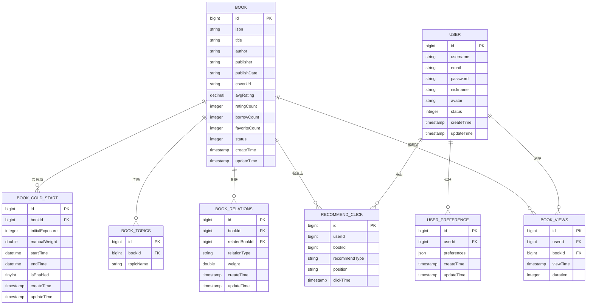

# Docker容器化

<cite>
**本文引用的文件**
- [pom.xml](file://pom.xml)
- [application.yml](file://src/main/resources/application.yml)
- [data_library126_db.sql](file://src/main/resources/data_library126_db.sql)
- [BackendApplication.java](file://src/main/java/org/example/backend/BackendApplication.java)
- [WebMvcConfig.java](file://src/main/java/org/example/backend/config/WebMvcConfig.java)
- [SecurityConfig.java](file://src/main/java/org/example/backend/config/SecurityConfig.java)
- [RecommendController.java](file://src/main/java/org/example/backend/modules/recommend/controller/RecommendController.java)
- [RecommendService.java](file://src/main/java/org/example/backend/modules/recommend/service/RecommendService.java)
- [Book.java](file://src/main/java/org/example/backend/entity/Book.java)
- [User.java](file://src/main/java/org/example/backend/entity/User.java)
</cite>

## 目录
1. [简介](#简介)
2. [项目结构](#项目结构)
3. [核心组件](#核心组件)
4. [架构总览](#架构总览)
5. [详细组件分析](#详细组件分析)
6. [依赖关系分析](#依赖关系分析)
7. [性能考虑](#性能考虑)
8. [故障排除指南](#故障排除指南)
9. [结论](#结论)
10. [附录](#附录)

## 简介
本文件面向智能图书推荐系统的Docker容器化部署，提供从Dockerfile编写到多阶段构建、镜像优化与安全最佳实践的完整指南；涵盖容器编排配置（docker-compose.yml）、数据库与Redis容器配置、容器间网络通信、健康检查、资源限制与日志收集；并给出部署命令示例与常见问题解决方案。

## 项目结构
该后端采用Spring Boot + MyBatis-Plus + MySQL + Redis的技术栈，核心模块包括：
- 应用入口与配置：Spring Boot主类、Web与安全配置、Swagger文档
- 数据层：MySQL连接配置、MyBatis-Plus实体映射与逻辑删除
- 推荐模块：推荐接口控制器与服务定义
- 文件上传：静态资源映射与上传目录配置

图表来源
- [BackendApplication.java](file://src/main/java/org/example/backend/BackendApplication.java#L1-L14)
- [application.yml](file://src/main/resources/application.yml#L1-L71)

章节来源
- [BackendApplication.java](file://src/main/java/org/example/backend/BackendApplication.java#L1-L14)
- [application.yml](file://src/main/resources/application.yml#L1-L71)

## 核心组件
- 应用容器：运行Spring Boot后端，监听9090端口，提供REST API与Swagger UI
- 数据库容器：MySQL 8.0，初始化脚本包含图书、用户、推荐相关表
- 缓存容器：Redis，用于会话状态（无状态化）、会话共享与短期数据缓存
- 文件存储：应用上传目录映射至宿主机，便于持久化与备份

章节来源
- [application.yml](file://src/main/resources/application.yml#L1-L71)
- [data_library126_db.sql](file://src/main/resources/data_library126_db.sql#L1-L200)

## 架构总览
容器化架构由三类容器组成：应用容器、数据库容器、Redis容器。应用通过环境变量或配置文件连接数据库与Redis；容器间通过Docker网络互通；应用暴露9090端口供外部访问；Swagger UI在开发环境可用。

图表来源
- [application.yml](file://src/main/resources/application.yml#L10-L43)
- [RecommendController.java](file://src/main/java/org/example/backend/modules/recommend/controller/RecommendController.java#L1-L130)

## 详细组件分析

### 应用容器（后端服务）
- 启动入口：Spring Boot主类负责启动Web服务器
- 端口与上下文：默认监听9090端口，context-path为根路径
- 安全与CORS：启用无状态会话，开放Swagger与公开接口，支持跨域
- 数据源与MyBatis-Plus：配置MySQL驱动、连接参数、驼峰映射、逻辑删除字段
- Redis：可选配置，用于会话状态与缓存
- 文件上传：静态资源映射到本地目录，支持上传文件访问
- 日志：控制台输出格式与级别配置

图表来源
- [BackendApplication.java](file://src/main/java/org/example/backend/BackendApplication.java#L1-L14)
- [SecurityConfig.java](file://src/main/java/org/example/backend/config/SecurityConfig.java#L1-L101)
- [WebMvcConfig.java](file://src/main/java/org/example/backend/config/WebMvcConfig.java#L1-L29)
- [RecommendController.java](file://src/main/java/org/example/backend/modules/recommend/controller/RecommendController.java#L1-L130)

章节来源
- [BackendApplication.java](file://src/main/java/org/example/backend/BackendApplication.java#L1-L14)
- [SecurityConfig.java](file://src/main/java/org/example/backend/config/SecurityConfig.java#L1-L101)
- [WebMvcConfig.java](file://src/main/java/org/example/backend/config/WebMvcConfig.java#L1-L29)
- [application.yml](file://src/main/resources/application.yml#L1-L71)

### 数据库容器（MySQL）
- 版本：MySQL 8.0
- 初始化：使用提供的SQL脚本初始化数据库结构与部分数据
- 连接参数：驱动类名、URL、用户名、密码、时区与字符集
- MyBatis-Plus：逻辑删除字段配置，驼峰映射开启

图表来源
- [data_library126_db.sql](file://src/main/resources/data_library126_db.sql#L20-L200)
- [Book.java](file://src/main/java/org/example/backend/entity/Book.java#L1-L95)
- [User.java](file://src/main/java/org/example/backend/entity/User.java#L1-L64)

章节来源
- [application.yml](file://src/main/resources/application.yml#L10-L30)
- [data_library126_db.sql](file://src/main/resources/data_library126_db.sql#L1-L200)

### 缓存容器（Redis）
- 地址与端口：默认localhost:6379
- 超时与连接池：超时时间、最大/最小空闲连接数
- 使用场景：会话状态（无状态化）、短期数据缓存、会话共享

章节来源
- [application.yml](file://src/main/resources/application.yml#L31-L43)

### 推荐模块（API）
- 接口范围：首页推荐、新书、热门、主题、相似图书、用户也读、曝光/点击、反馈、热门主题、长尾推荐
- 权限控制：公开接口、管理员接口、认证接口、匿名可访问的推荐接口
- 参数与返回：统一响应包装、分页与权重参数

图表来源
- [RecommendController.java](file://src/main/java/org/example/backend/modules/recommend/controller/RecommendController.java#L27-L39)
- [RecommendService.java](file://src/main/java/org/example/backend/modules/recommend/service/RecommendService.java#L14-L17)

章节来源
- [RecommendController.java](file://src/main/java/org/example/backend/modules/recommend/controller/RecommendController.java#L1-L130)
- [RecommendService.java](file://src/main/java/org/example/backend/modules/recommend/service/RecommendService.java#L1-L70)

## 依赖关系分析
- 应用对数据库与Redis存在运行时依赖
- 推荐模块依赖用户行为数据与图书元数据
- 安全配置影响接口访问权限与CORS策略

图表来源
- [SecurityConfig.java](file://src/main/java/org/example/backend/config/SecurityConfig.java#L46-L81)
- [application.yml](file://src/main/resources/application.yml#L10-L43)

章节来源
- [SecurityConfig.java](file://src/main/java/org/example/backend/config/SecurityConfig.java#L1-L101)
- [application.yml](file://src/main/resources/application.yml#L1-L71)

## 性能考虑
- JVM与容器内存：建议在容器中设置JVM堆大小上限，避免GC压力过大
- 连接池：数据库与Redis连接池参数需结合并发请求调优
- 缓存策略：热点数据放入Redis，减少数据库压力
- 文件上传：上传目录映射到持久卷，避免频繁IO阻塞
- 日志级别：生产环境降低日志级别，避免I/O瓶颈

## 故障排除指南
- 数据库连接失败
  - 检查数据库容器是否启动、端口是否开放、凭据是否正确
  - 确认初始化脚本执行成功，数据库与表存在
- Redis连接异常
  - 检查Redis容器状态、网络连通性与密码配置
- Swagger无法访问
  - 确认Swagger开关已启用且端口映射正确
- 推荐接口报错
  - 检查用户偏好与图书数据是否存在，确认推荐模块依赖的数据完整性
- CORS跨域问题
  - 确认CORS配置允许的来源与方法，生产环境建议收窄来源

章节来源
- [application.yml](file://src/main/resources/application.yml#L10-L56)
- [SecurityConfig.java](file://src/main/java/org/example/backend/config/SecurityConfig.java#L86-L98)

## 结论
通过Docker容器化部署，智能图书推荐系统可以实现快速、可移植、可扩展的上线与运维。建议采用多阶段构建以减小镜像体积，合理配置健康检查与资源限制，确保数据库与Redis的高可用与数据一致性，并通过日志与监控体系保障线上稳定性。

## 附录

### Dockerfile编写指南与多阶段构建策略
- 基础镜像选择：使用官方OpenJDK镜像作为基础，确保运行时环境一致
- 多阶段构建
  - 第一阶段：使用Maven构建可执行JAR，包含编译、测试与打包
  - 第二阶段：复制JAR到精简的基础运行时镜像，仅保留运行所需组件
- 最终镜像优化
  - 清理构建缓存与依赖缓存
  - 设置非root用户运行，降低权限风险
  - 合理设置JVM参数与容器资源限制
- 健康检查
  - 使用HTTP探测或TCP探测，检测应用端口与关键接口
- 安全最佳实践
  - 使用只读根文件系统、最小权限原则、密钥注入而非硬编码
  - 禁用不必要的网络端口，使用网络隔离

### docker-compose.yml编写要点
- 服务定义
  - 应用服务：映射端口、挂载上传目录、设置环境变量（数据库与Redis连接信息）
  - 数据库服务：持久化卷、初始化脚本、环境变量（root密码、数据库名）
  - 缓存服务：持久化卷、端口映射
- 网络与依赖
  - 定义自定义网络，确保服务间可通过服务名互相访问
  - 使用depends_on确保数据库先于应用启动
- 健康检查与重启策略
  - 为数据库与Redis配置健康检查
  - 应用设置重启策略，保证服务可用性
- 资源限制
  - 限制CPU与内存，防止资源争用
- 日志收集
  - 使用日志驱动收集容器日志，集中化存储

### 容器间网络通信设置
- 自定义网络：应用、数据库、Redis在同一网络内，通过服务名互访
- 端口映射：应用对外暴露9090，数据库3306，Redis6379
- DNS解析：服务名即主机名，无需硬编码IP

### 数据库与Redis容器配置
- 数据库
  - 初始化脚本：使用提供的SQL文件进行初始化
  - 连接参数：驱动类名、URL、用户名、密码、时区与字符集
- 缓存
  - 连接参数：主机、端口、密码、数据库索引、超时与连接池
  - 使用场景：会话状态、短期缓存、会话共享

### 健康检查、资源限制与日志收集
- 健康检查
  - 应用：HTTP GET /actuator/health 或应用根路径探测
  - 数据库：TCP端口探测
  - Redis：TCP端口探测
- 资源限制
  - CPU配额与内存上限，避免资源争用
- 日志收集
  - 使用JSON日志格式，集中化收集（如ELK/Fluentd）

### 部署命令示例
- 构建镜像
  - docker build -t library-backend:latest .
- 启动容器
  - docker run -d --name mysql -p 3306:3306 -e MYSQL_ROOT_PASSWORD=your_root_password library/mysql:8.0
  - docker run -d --name redis -p 6379:6379 redis:alpine
  - docker run -d --name backend -p 9090:9090 --link mysql --link redis library-backend:latest
- 使用Compose
  - docker-compose up -d
  - docker-compose down

### 常见问题与解决方案
- 应用启动失败
  - 检查数据库与Redis连通性与凭据
  - 查看容器日志定位错误
- 端口冲突
  - 修改映射端口或停止占用进程
- 权限不足
  - 确保上传目录挂载权限正确
- 性能问题
  - 调整JVM参数与连接池大小，启用Redis缓存