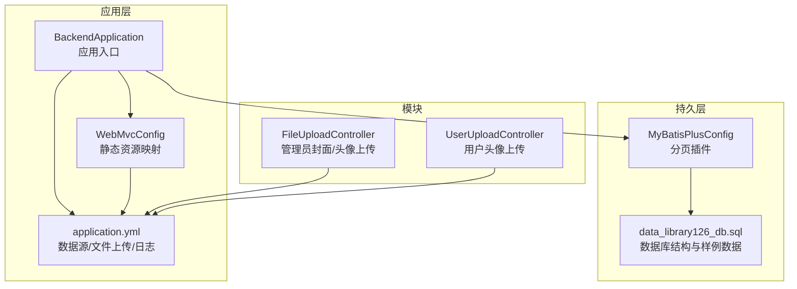
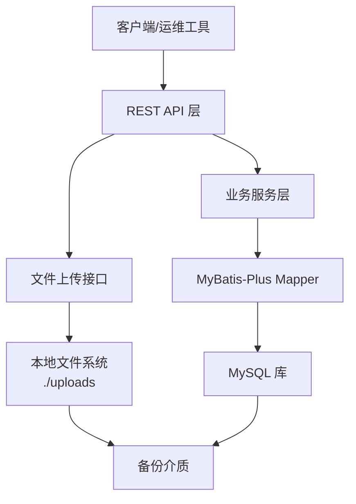
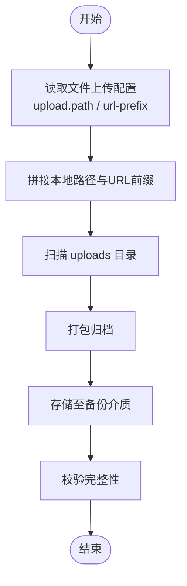
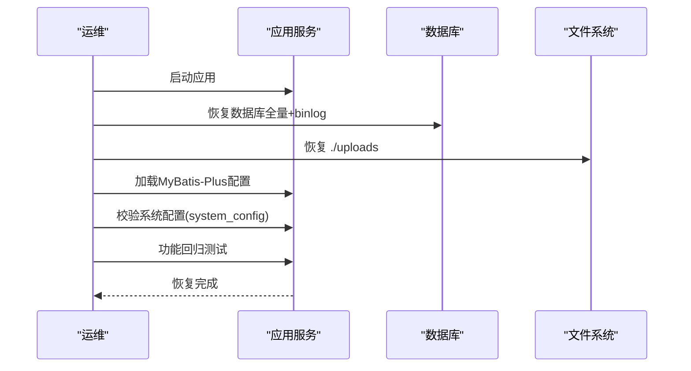
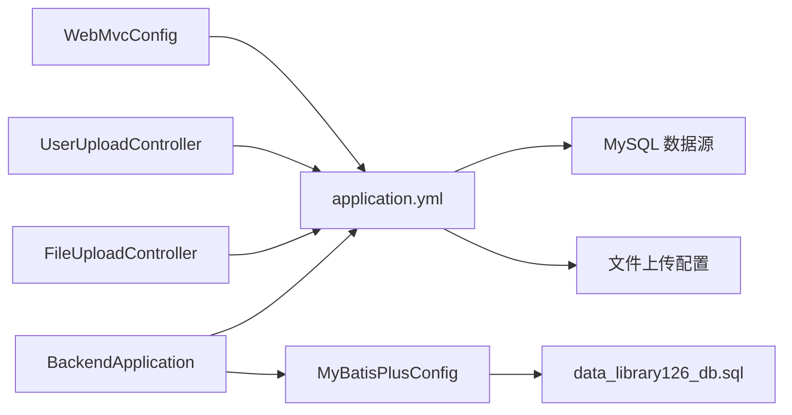

# 备份恢复

<cite>
**本文引用的文件**
- [application.yml](file://src/main/resources/application.yml)
- [BackendApplication.java](file://src/main/java/org/example/backend/BackendApplication.java)
- [data_library126_db.sql](file://src/main/resources/data_library126_db.sql)
- [FileUploadController.java](file://src/main/java/org/example/backend/modules/admin/controller/FileUploadController.java)
- [UserUploadController.java](file://src/main/java/org/example/backend/modules/user/controller/UserUploadController.java)
- [WebMvcConfig.java](file://src/main/java/org/example/backend/config/WebMvcConfig.java)
- [MyBatisPlusConfig.java](file://src/main/java/org/example/backend/config/MyBatisPlusConfig.java)
- [pom.xml](file://pom.xml)
- [User.java](file://src/main/java/org/example/backend/entity/User.java)
- [Book.java](file://src/main/java/org/example/backend/entity/Book.java)
- [RecommendAnalytics.java](file://src/main/java/org/example/backend/entity/RecommendAnalytics.java)
- [RecommendClick.java](file://src/main/java/org/example/backend/entity/RecommendClick.java)
- [RecommendExposure.java](file://src/main/java/org/example/backend/entity/RecommendExposure.java)
- [SystemConfig.java](file://src/main/java/org/example/backend/entity/SystemConfig.java)
- [SystemConfigMapper.java](file://src/main/java/org/example/backend/modules/admin/repository/SystemConfigMapper.java)
</cite>

## 目录
1. [简介](#简介)
2. [项目结构](#项目结构)
3. [核心组件](#核心组件)
4. [架构总览](#架构总览)
5. [详细组件分析](#详细组件分析)
6. [依赖分析](#依赖分析)
7. [性能考虑](#性能考虑)
8. [故障排查指南](#故障排查指南)
9. [结论](#结论)
10. [附录](#附录)

## 简介
本文件为智能图书推荐系统的备份恢复文档，围绕数据库全量/增量/实时备份策略、灾难恢复流程、备份脚本与自动化任务、安全存储与访问控制、恢复测试与RTO/RPO指标、以及运维标准化操作手册进行系统化阐述。结合代码库中的数据库结构、文件上传与静态资源映射、MyBatis-Plus配置与系统配置项，给出可落地的备份恢复方案。

## 项目结构
系统采用Spring Boot + MyBatis-Plus架构，数据库连接在配置文件中集中定义；文件上传与静态资源映射通过控制器与Web配置完成；推荐分析、曝光与点击等行为数据用于评估RTO/RPO与恢复窗口。

**图表来源**
- [BackendApplication.java](file://src/main/java/org/example/backend/BackendApplication.java#L1-L14)
- [application.yml](file://src/main/resources/application.yml#L1-L71)
- [WebMvcConfig.java](file://src/main/java/org/example/backend/config/WebMvcConfig.java#L1-L28)
- [MyBatisPlusConfig.java](file://src/main/java/org/example/backend/config/MyBatisPlusConfig.java#L1-L28)
- [data_library126_db.sql](file://src/main/resources/data_library126_db.sql#L1-L1096)
- [FileUploadController.java](file://src/main/java/org/example/backend/modules/admin/controller/FileUploadController.java#L1-L136)
- [UserUploadController.java](file://src/main/java/org/example/backend/modules/user/controller/UserUploadController.java#L1-L86)

**章节来源**
- [application.yml](file://src/main/resources/application.yml#L1-L71)
- [BackendApplication.java](file://src/main/java/org/example/backend/BackendApplication.java#L1-L14)
- [WebMvcConfig.java](file://src/main/java/org/example/backend/config/WebMvcConfig.java#L1-L28)
- [MyBatisPlusConfig.java](file://src/main/java/org/example/backend/config/MyBatisPlusConfig.java#L1-L28)
- [data_library126_db.sql](file://src/main/resources/data_library126_db.sql#L1-L1096)
- [FileUploadController.java](file://src/main/java/org/example/backend/modules/admin/controller/FileUploadController.java#L1-L136)
- [UserUploadController.java](file://src/main/java/org/example/backend/modules/user/controller/UserUploadController.java#L1-L86)

## 核心组件
- 数据库与数据模型：系统使用MySQL作为主存储，包含用户、图书、评分、评论、借阅、收藏、推荐曝光/点击、推荐分析等核心表，覆盖业务数据与行为日志。
- 文件存储与静态资源：系统支持封面与头像上传，静态资源通过Web配置映射到本地目录，便于备份与恢复。
- 配置中心：系统配置项（如Redis开关、缓存TTL）位于系统配置表，可通过接口读取，便于备份恢复后的配置一致性核验。

**章节来源**
- [data_library126_db.sql](file://src/main/resources/data_library126_db.sql#L268-L311)
- [User.java](file://src/main/java/org/example/backend/entity/User.java#L1-L64)
- [Book.java](file://src/main/java/org/example/backend/entity/Book.java#L1-L95)
- [RecommendAnalytics.java](file://src/main/java/org/example/backend/entity/RecommendAnalytics.java#L1-L65)
- [RecommendClick.java](file://src/main/java/org/example/backend/entity/RecommendClick.java#L1-L49)
- [RecommendExposure.java](file://src/main/java/org/example/backend/entity/RecommendExposure.java#L1-L49)
- [SystemConfig.java](file://src/main/java/org/example/backend/entity/SystemConfig.java#L1-L48)
- [SystemConfigMapper.java](file://src/main/java/org/example/backend/modules/admin/repository/SystemConfigMapper.java#L1-L13)

## 架构总览
系统以MySQL为核心数据存储，配合文件上传与静态资源映射，形成“结构化数据+非结构化资源”的双备份对象。推荐分析、曝光与点击表用于衡量业务连续性指标，支撑RTO/RPO设定与恢复验证。

**图表来源**
- [application.yml](file://src/main/resources/application.yml#L10-L43)
- [FileUploadController.java](file://src/main/java/org/example/backend/modules/admin/controller/FileUploadController.java#L36-L83)
- [UserUploadController.java](file://src/main/java/org/example/backend/modules/user/controller/UserUploadController.java#L36-L83)
- [WebMvcConfig.java](file://src/main/java/org/example/backend/config/WebMvcConfig.java#L21-L25)

## 详细组件分析

### 数据库备份策略
- 全量备份
  - 使用数据库自带工具执行全量逻辑/物理备份，建议在业务低峰期执行，保留备份文件至异地存储。
  - 备份对象：library_db（含用户、图书、评分、评论、借阅、收藏、推荐分析、曝光/点击等表）。
- 增量备份
  - 基于二进制日志（binlog）进行增量备份，结合全量备份周期，确保最小RPO。
  - 建议每日一次增量备份，保留7-14天滚动窗口。
- 实时备份
  - 对高频写入表（如推荐曝光/点击、评分、评论）可考虑应用层落盘或异步队列持久化，作为“准实时”数据保护补充。
- 备份频率与窗口
  - 全量：每周全备，每日增备；业务高峰期前后增加全量备份频次。
  - RPO：目标≤15分钟（binlog增量），RTO：目标≤2小时（含恢复验证）。
- 存储位置
  - 本地磁盘：/var/lib/mysql-backup（示例），保留最近30天；异地云存储备份。
- 备份验证
  - 定期抽样恢复演练，验证数据完整性与业务可用性；对推荐分析表进行抽样统计核对。

**章节来源**
- [data_library126_db.sql](file://src/main/resources/data_library126_db.sql#L1-L1096)
- [application.yml](file://src/main/resources/application.yml#L10-L15)

### 文件与静态资源备份
- 文件上传路径与URL前缀由配置文件统一管理，静态资源映射通过Web配置生效。
- 备份范围：./uploads 下的封面与头像目录，按日期子目录组织。
- 备份策略：每日全量+差异，结合版本控制与快照，确保资源可回溯。

**图表来源**
- [application.yml](file://src/main/resources/application.yml#L57-L61)
- [WebMvcConfig.java](file://src/main/java/org/example/backend/config/WebMvcConfig.java#L21-L25)
- [FileUploadController.java](file://src/main/java/org/example/backend/modules/admin/controller/FileUploadController.java#L54-L77)
- [UserUploadController.java](file://src/main/java/org/example/backend/modules/user/controller/UserUploadController.java#L54-L77)

**章节来源**
- [application.yml](file://src/main/resources/application.yml#L57-L61)
- [WebMvcConfig.java](file://src/main/java/org/example/backend/config/WebMvcConfig.java#L1-L28)
- [FileUploadController.java](file://src/main/java/org/example/backend/modules/admin/controller/FileUploadController.java#L1-L136)
- [UserUploadController.java](file://src/main/java/org/example/backend/modules/user/controller/UserUploadController.java#L1-L86)

### 灾难恢复流程
- 系统故障恢复
  - 启动应用与数据库，确认数据源连接正常；加载MyBatis-Plus配置与分页插件。
  - 恢复静态资源：将./uploads目录恢复至原位，检查Web静态资源映射。
- 数据恢复
  - 优先使用最近全量备份+binlog增量恢复；对推荐分析表进行抽样核对。
  - 校验关键表：users、books、ratings、comments、borrow_records、recommend_*。
- 业务连续性保障
  - 通过系统配置表（system_config）核验Redis开关与缓存TTL等关键参数。
  - 进行功能回归测试：登录、评分、评论、借阅、推荐曝光/点击链路。

**图表来源**
- [BackendApplication.java](file://src/main/java/org/example/backend/BackendApplication.java#L1-L14)
- [MyBatisPlusConfig.java](file://src/main/java/org/example/backend/config/MyBatisPlusConfig.java#L1-L28)
- [SystemConfig.java](file://src/main/java/org/example/backend/entity/SystemConfig.java#L1-L48)
- [SystemConfigMapper.java](file://src/main/java/org/example/backend/modules/admin/repository/SystemConfigMapper.java#L1-L13)

**章节来源**
- [BackendApplication.java](file://src/main/java/org/example/backend/BackendApplication.java#L1-L14)
- [MyBatisPlusConfig.java](file://src/main/java/org/example/backend/config/MyBatisPlusConfig.java#L1-L28)
- [SystemConfig.java](file://src/main/java/org/example/backend/entity/SystemConfig.java#L1-L48)
- [SystemConfigMapper.java](file://src/main/java/org/example/backend/modules/admin/repository/SystemConfigMapper.java#L1-L13)

### 备份脚本编写指南
- 脚本要素
  - 数据库：mysqldump 或 percona-xtrabackup，输出带时间戳的压缩包。
  - 文件系统：rsync 或 tar 归档 ./uploads。
  - 校验：计算校验和并记录元数据。
  - 通知：失败告警与成功归档通知。
- 自动化任务
  - 使用cron定时任务：每日增量、每周全量；备份完成后触发校验与上报。
  - 结合容器编排（如Kubernetes CronJob）实现跨节点一致性。

[本节为通用指导，无需特定文件引用]

### 备份数据的安全存储、加密传输与访问控制
- 存储安全
  - 异地容灾：至少两套备份介质，分别存放于不同地理区域。
  - 加密：对备份文件进行加密存储，密钥分离管理。
- 传输安全
  - 使用安全通道（如SFTP/HTTPS）传输备份文件至远端存储。
- 访问控制
  - 仅授权人员可访问备份介质；审计备份访问日志。

[本节为通用指导，无需特定文件引用]

### 恢复测试流程、RTO/RPO指标与应急响应预案
- 恢复测试
  - 定期进行抽样恢复演练：随机抽取关键业务表与静态资源进行恢复验证。
  - 指标核对：推荐分析表抽样统计、用户/图书数据一致性。
- RTO/RPO
  - RPO：≤15分钟（binlog增量）；RTO：≤2小时（含验证）。
- 应急响应
  - 故障分级与处置流程、责任人与联系方式、回退策略与公告机制。

[本节为通用指导，无需特定文件引用]

### 运维标准化操作手册
- 备份操作
  - 执行顺序：数据库全量→文件系统全量→数据库binlog→文件系统差异。
  - 记录：备份时间、文件名、校验和、存储位置。
- 恢复操作
  - 数据库：停止应用→恢复全量+binlog→启动应用→功能验证。
  - 文件系统：恢复 ./uploads → 校验静态资源可访问。
- 监控与告警
  - 备份成功率监控、延迟与失败告警、自动重试与人工介入阈值。

[本节为通用指导，无需特定文件引用]

## 依赖分析
系统依赖关系围绕数据源、持久层与文件上传展开，备份恢复需同时覆盖数据库与文件系统。

**图表来源**
- [BackendApplication.java](file://src/main/java/org/example/backend/BackendApplication.java#L1-L14)
- [application.yml](file://src/main/resources/application.yml#L10-L61)
- [MyBatisPlusConfig.java](file://src/main/java/org/example/backend/config/MyBatisPlusConfig.java#L1-L28)
- [data_library126_db.sql](file://src/main/resources/data_library126_db.sql#L1-L1096)
- [FileUploadController.java](file://src/main/java/org/example/backend/modules/admin/controller/FileUploadController.java#L1-L136)
- [UserUploadController.java](file://src/main/java/org/example/backend/modules/user/controller/UserUploadController.java#L1-L86)
- [WebMvcConfig.java](file://src/main/java/org/example/backend/config/WebMvcConfig.java#L1-L28)

**章节来源**
- [pom.xml](file://pom.xml#L19-L114)
- [application.yml](file://src/main/resources/application.yml#L10-L61)
- [MyBatisPlusConfig.java](file://src/main/java/org/example/backend/config/MyBatisPlusConfig.java#L1-L28)
- [data_library126_db.sql](file://src/main/resources/data_library126_db.sql#L1-L1096)
- [FileUploadController.java](file://src/main/java/org/example/backend/modules/admin/controller/FileUploadController.java#L1-L136)
- [UserUploadController.java](file://src/main/java/org/example/backend/modules/user/controller/UserUploadController.java#L1-L86)
- [WebMvcConfig.java](file://src/main/java/org/example/backend/config/WebMvcConfig.java#L1-L28)

## 性能考虑
- 备份窗口与业务影响
  - 全量备份建议在业务低峰期执行；增量备份对在线业务影响较小。
- I/O与网络
  - 备份并发度与压缩算法需平衡吞吐与CPU占用；远端传输建议开启压缩与断点续传。
- 恢复效率
  - 采用并行恢复与索引重建优化；对大表分批导入与批量提交。

[本节为通用指导，无需特定文件引用]

## 故障排查指南
- 数据库连接失败
  - 检查数据源URL、账号密码与网络连通性；确认MySQL服务状态。
- 文件资源不可访问
  - 核对Web静态资源映射路径与上传目录权限；确认URL前缀配置一致。
- 推荐分析数据缺失
  - 核对binlog恢复是否完整；对推荐曝光/点击表进行抽样统计对比。

**章节来源**
- [application.yml](file://src/main/resources/application.yml#L10-L15)
- [WebMvcConfig.java](file://src/main/java/org/example/backend/config/WebMvcConfig.java#L21-L25)
- [data_library126_db.sql](file://src/main/resources/data_library126_db.sql#L464-L481)

## 结论
通过“数据库全量+binlog增量+文件系统全量/差异”的组合策略，结合严格的备份验证、安全存储与访问控制，可有效满足智能图书推荐系统的RTO/RPO目标。配套的恢复测试与标准化运维流程，能够保障业务连续性与快速恢复能力。

## 附录
- 关键表清单（备份重点）
  - users、books、ratings、comments、borrow_records、favorites、feedback、booklist_*、book_topics、book_relations、recommend_*、system_config
- 备份介质建议
  - 本地SSD阵列+异地云存储；加密归档与版本保留策略明确

**章节来源**
- [data_library126_db.sql](file://src/main/resources/data_library126_db.sql#L268-L311)
- [data_library126_db.sql](file://src/main/resources/data_library126_db.sql#L436-L462)
- [data_library126_db.sql](file://src/main/resources/data_library126_db.sql#L734-L755)
- [data_library126_db.sql](file://src/main/resources/data_library126_db.sql#L833-L846)