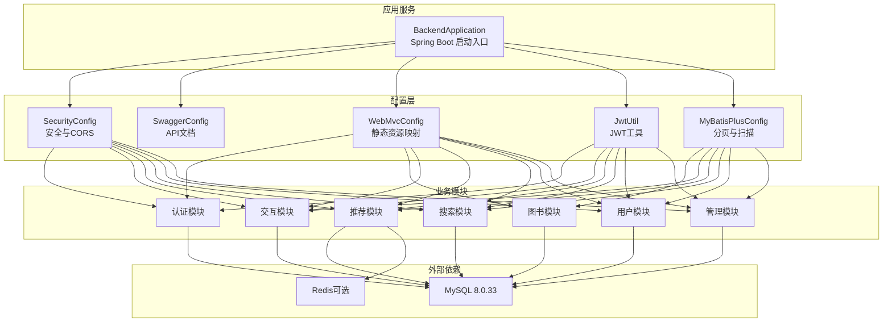
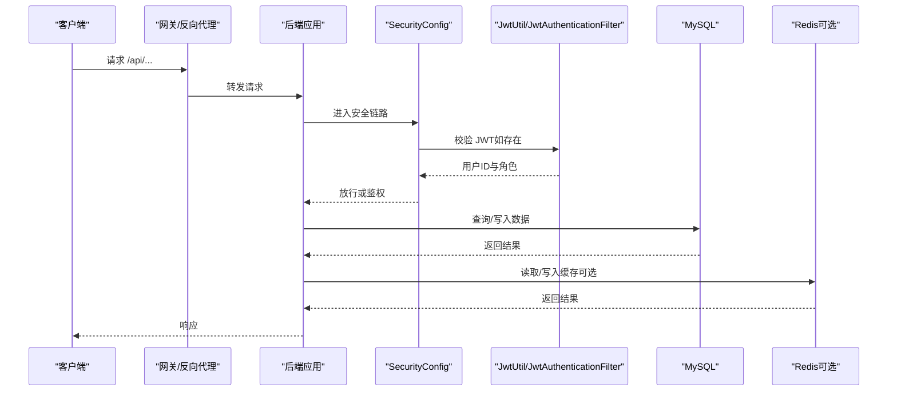
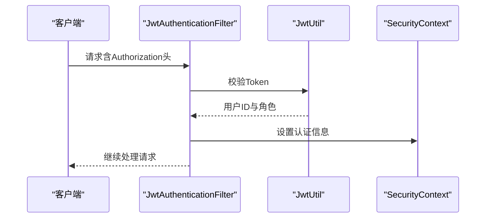
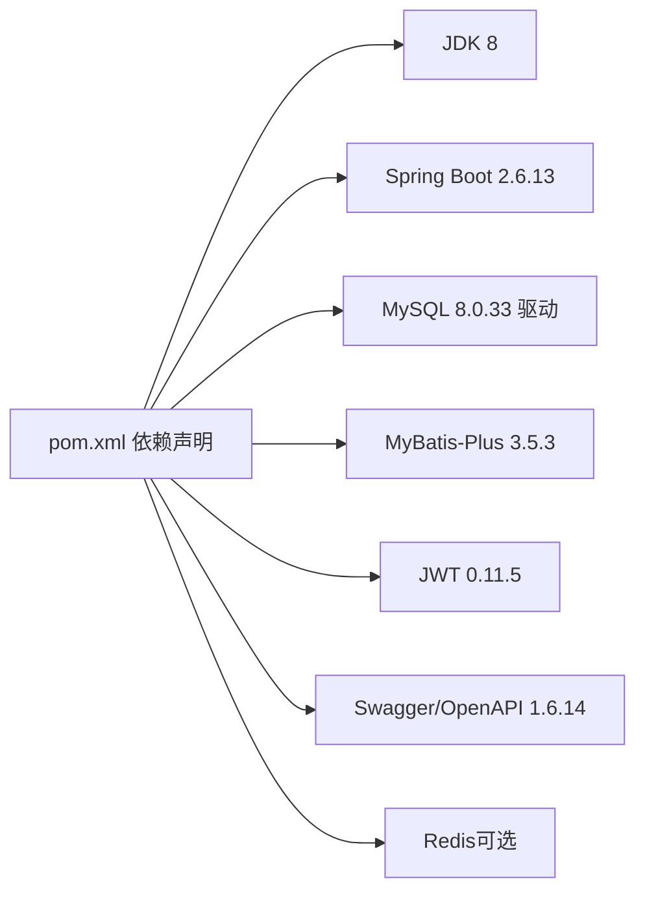

# 环境部署

<cite>
**本文引用的文件**
- [application.yml](file://src/main/resources/application.yml)
- [pom.xml](file://pom.xml)
- [BackendApplication.java](file://src/main/java/org/example/backend/BackendApplication.java)
- [data_library126_db.sql](file://src/main/resources/data_library126_db.sql)
- [JwtUtil.java](file://src/main/java/org/example/backend/config/JwtUtil.java)
- [WebMvcConfig.java](file://src/main/java/org/example/backend/config/WebMvcConfig.java)
- [SecurityConfig.java](file://src/main/java/org/example/backend/config/SecurityConfig.java)
- [SwaggerConfig.java](file://src/main/java/org/example/backend/config/SwaggerConfig.java)
- [MyBatisPlusConfig.java](file://src/main/java/org/example/backend/config/MyBatisPlusConfig.java)
- [JwtAuthenticationFilter.java](file://src/main/java/org/example/backend/modules/auth/filter/JwtAuthenticationFilter.java)
- [HELP.md](file://HELP.md)
</cite>

## 目录
1. [简介](#简介)
2. [项目结构](#项目结构)
3. [核心组件](#核心组件)
4. [架构总览](#架构总览)
5. [详细组件分析](#详细组件分析)
6. [依赖分析](#依赖分析)
7. [性能考虑](#性能考虑)
8. [故障排除指南](#故障排除指南)
9. [结论](#结论)
10. [附录](#附录)

## 简介
本文件为智能图书推荐系统的环境部署指南，覆盖开发、测试与生产环境的配置要求与部署步骤。文档重点说明以下依赖环境的安装与配置：
- JDK 8+
- MySQL 8.0.33
- Redis（可选）
同时提供 application.yml 的完整参数说明，涵盖数据库连接、JWT 密钥、Redis 配置、Swagger 开关等；并给出数据库初始化脚本执行流程与数据导入方法，以及环境变量、端口与防火墙配置建议，帮助运维人员完成完整的环境准备与验证。

## 项目结构
后端采用 Spring Boot 2.6.13 + MyBatis-Plus 架构，Maven 管理依赖与打包。核心模块包括：
- 配置层：安全、Swagger、Web 资源、MyBatis-Plus、JWT 工具
- 模块层：认证、图书、交互、推荐、搜索、用户、管理
- 资源层：application.yml、SQL 初始化脚本、单元测试入口

图表来源
- [BackendApplication.java](file://src/main/java/org/example/backend/BackendApplication.java#L1-L14)
- [SecurityConfig.java](file://src/main/java/org/example/backend/config/SecurityConfig.java#L1-L101)
- [SwaggerConfig.java](file://src/main/java/org/example/backend/config/SwaggerConfig.java#L1-L28)
- [WebMvcConfig.java](file://src/main/java/org/example/backend/config/WebMvcConfig.java#L1-L29)
- [JwtUtil.java](file://src/main/java/org/example/backend/config/JwtUtil.java#L1-L92)
- [MyBatisPlusConfig.java](file://src/main/java/org/example/backend/config/MyBatisPlusConfig.java#L1-L28)

章节来源
- [BackendApplication.java](file://src/main/java/org/example/backend/BackendApplication.java#L1-L14)
- [pom.xml](file://pom.xml#L1-L161)

## 核心组件
- 应用入口：Spring Boot 启动类负责加载配置与装配 Bean。
- 安全与认证：基于 Spring Security + JWT，支持跨域、匿名访问白名单、角色权限控制。
- 文档与资源：Swagger/OpenAPI 文档与静态资源映射（上传文件目录）。
- ORM 与分页：MyBatis-Plus 提供分页插件与 Mapper 扫描。
- 数据库与缓存：默认使用 MySQL，Redis 可选用于推荐系统缓存。

章节来源
- [SecurityConfig.java](file://src/main/java/org/example/backend/config/SecurityConfig.java#L1-L101)
- [JwtUtil.java](file://src/main/java/org/example/backend/config/JwtUtil.java#L1-L92)
- [WebMvcConfig.java](file://src/main/java/org/example/backend/config/WebMvcConfig.java#L1-L29)
- [MyBatisPlusConfig.java](file://src/main/java/org/example/backend/config/MyBatisPlusConfig.java#L1-L28)

## 架构总览
系统采用前后端分离架构，后端提供 RESTful API，前端通过 HTTP 访问。认证采用 JWT，安全策略在 SecurityConfig 中集中定义；Swagger 仅在开发阶段启用，生产环境建议关闭。

图表来源
- [SecurityConfig.java](file://src/main/java/org/example/backend/config/SecurityConfig.java#L46-L81)
- [JwtAuthenticationFilter.java](file://src/main/java/org/example/backend/modules/auth/filter/JwtAuthenticationFilter.java#L28-L56)
- [JwtUtil.java](file://src/main/java/org/example/backend/config/JwtUtil.java#L30-L42)

## 详细组件分析

### 数据库配置与初始化
- 连接参数：驱动类名、URL、用户名、密码均在 application.yml 中配置。
- 初始化脚本：提供完整的 SQL 脚本，包含图书、用户、借阅、评论、收藏、推荐等核心表。
- 执行流程：
  1) 准备 MySQL 8.0.33 实例，创建数据库与用户。
  2) 使用 SQL 客户端执行 data_library126_db.sql 完成建表与基础数据导入。
  3) 启动应用，确保 application.yml 中的数据库连接信息正确。
- 数据导入方法：
  - 命令行导入：mysql -u 用户名 -p 数据库名 < data_library126_db.sql
  - GUI 工具：Navicat/Workbench 导入 SQL 文件。
  - 注意：脚本包含外键约束与索引，确保 MySQL 版本兼容性。

章节来源
- [application.yml](file://src/main/resources/application.yml#L11-L15)
- [data_library126_db.sql](file://src/main/resources/data_library126_db.sql#L1-L1096)

### JWT 配置与认证流程
- 密钥与过期时间：在 application.yml 中配置，运行时由 JwtUtil 注入。
- 认证流程：
  1) 客户端携带 Authorization: Bearer Token 访问受保护接口。
  2) JwtAuthenticationFilter 从请求头提取 Token 并校验有效性。
  3) 校验通过后，将用户ID与角色注入 Spring Security 上下文，便于后续授权与业务使用。
- 生产建议：
  - 使用强密钥（至少 256 位），定期轮换。
  - 控制过期时间，结合刷新机制提升安全性。

图表来源
- [JwtAuthenticationFilter.java](file://src/main/java/org/example/backend/modules/auth/filter/JwtAuthenticationFilter.java#L28-L56)
- [JwtUtil.java](file://src/main/java/org/example/backend/config/JwtUtil.java#L30-L81)

章节来源
- [application.yml](file://src/main/resources/application.yml#L44-L47)
- [JwtUtil.java](file://src/main/java/org/example/backend/config/JwtUtil.java#L1-L92)
- [JwtAuthenticationFilter.java](file://src/main/java/org/example/backend/modules/auth/filter/JwtAuthenticationFilter.java#L1-L70)

### Swagger/OpenAPI 文档
- 开关与路径：在 application.yml 中开启/关闭，并指定 UI 与文档路径。
- 生产建议：建议在生产关闭 Swagger，避免暴露接口细节。

章节来源
- [application.yml](file://src/main/resources/application.yml#L49-L55)
- [SwaggerConfig.java](file://src/main/java/org/example/backend/config/SwaggerConfig.java#L1-L28)

### 文件上传与静态资源
- 上传路径与 URL 前缀：在 application.yml 中配置，WebMvcConfig 将其映射为静态资源访问。
- 建议：确保上传目录具备读写权限，且与 Nginx/Apache 等反向代理正确配合。

章节来源
- [application.yml](file://src/main/resources/application.yml#L57-L61)
- [WebMvcConfig.java](file://src/main/java/org/example/backend/config/WebMvcConfig.java#L1-L29)

### 安全与跨域
- 白名单：公开接口（如认证、Swagger、部分只读接口）无需认证。
- CORS：允许任意来源、方法与头，支持凭据。
- 角色控制：管理员接口需 ADMIN 角色。

章节来源
- [SecurityConfig.java](file://src/main/java/org/example/backend/config/SecurityConfig.java#L52-L78)

### MyBatis-Plus 配置
- Mapper 扫描：自动扫描各模块 repository 包。
- 分页插件：集成 MySQL 分页内核，支持全局分页。

章节来源
- [MyBatisPlusConfig.java](file://src/main/java/org/example/backend/config/MyBatisPlusConfig.java#L1-L28)

## 依赖分析
- JDK：Java 8（兼容性与稳定性）
- Spring Boot：2.6.13（稳定版本）
- MySQL：8.0.33（驱动版本）
- MyBatis-Plus：3.5.3（ORM 与分页）
- JWT：0.11.5（令牌）
- Swagger/OpenAPI：1.6.14（文档）
- Redis：可选（spring-boot-starter-data-redis）

图表来源
- [pom.xml](file://pom.xml#L10-L18)
- [pom.xml](file://pom.xml#L21-L82)

章节来源
- [pom.xml](file://pom.xml#L1-L161)

## 性能考虑
- 数据库连接池与索引：确保 MySQL 连接参数合理，表结构与索引满足查询需求。
- 缓存策略：Redis 可用于热点数据与推荐结果缓存，减少数据库压力。
- 分页与查询：使用 MyBatis-Plus 分页插件，避免一次性返回大量数据。
- 日志级别：生产环境建议降低日志级别，避免影响性能。

## 故障排除指南
- 启动失败（端口占用）
  - 检查 server.port 是否被占用，修改为可用端口。
- 数据库连接异常
  - 核对 application.yml 中的数据库 URL、用户名、密码与数据库名。
  - 确认 MySQL 8.0.33 正常运行且网络可达。
- JWT 校验失败
  - 确认密钥与过期时间配置一致，Token 格式正确（Bearer）。
- Swagger 无法访问
  - 确认 springdoc.api-docs.path 与 springdoc.swagger-ui.path 配置正确，且 enabled 为 true。
- 文件上传失败
  - 检查 file.upload.path 与 file.upload.url-prefix，确认目录存在且具备读写权限。

章节来源
- [application.yml](file://src/main/resources/application.yml#L1-L71)
- [JwtUtil.java](file://src/main/java/org/example/backend/config/JwtUtil.java#L21-L25)
- [WebMvcConfig.java](file://src/main/java/org/example/backend/config/WebMvcConfig.java#L14-L18)

## 结论
本部署文档提供了从环境准备、依赖安装、配置说明到数据库初始化与运维验证的全流程指导。按照本文档操作，可在开发、测试与生产环境中快速搭建智能图书推荐系统后端服务。建议在生产环境关闭 Swagger、强化 JWT 密钥管理、完善 Redis 缓存策略，并持续监控数据库与应用性能。

## 附录

### 环境准备清单（运维）
- 操作系统：Linux/Windows（建议 Linux）
- JDK：JDK 8+（推荐使用官方 LTS 版本）
- MySQL：8.0.33（创建数据库与用户，开放远程访问权限）
- Redis：可选（6379 端口，无密码或配置密码）
- Maven：用于构建与打包
- 反向代理：Nginx/Apache（静态资源与 HTTPS）
- 防火墙：开放应用端口（默认 9090）、MySQL（3306）、Redis（6379）

章节来源
- [pom.xml](file://pom.xml#L10-L18)
- [application.yml](file://src/main/resources/application.yml#L1-L71)

### 端口与防火墙配置
- 应用端口：9090（server.port）
- MySQL：3306
- Redis：6379
- Swagger UI：/swagger-ui.html
- API 文档：/v3/api-docs

章节来源
- [application.yml](file://src/main/resources/application.yml#L1-L71)

### application.yml 参数说明
- server.port：应用监听端口
- server.servlet.context-path：上下文路径
- spring.application.name：应用名称
- spring.datasource.*：数据库连接参数（驱动、URL、用户名、密码）
- spring.redis.*：Redis 连接参数（host、port、password、database、timeout、pool）
- jwt.secret：JWT 密钥（建议至少 256 位）
- jwt.expiration：Token 过期时间（毫秒）
- springdoc.*：Swagger 文档路径与开关
- file.upload.*：文件上传路径与 URL 前缀
- logging.*：日志级别与格式

章节来源
- [application.yml](file://src/main/resources/application.yml#L1-L71)

### 数据库初始化脚本执行流程
- 创建数据库与用户
- 执行 data_library126_db.sql 完成建表与基础数据导入
- 启动应用，检查数据库连接与表结构

章节来源
- [data_library126_db.sql](file://src/main/resources/data_library126_db.sql#L1-L1096)