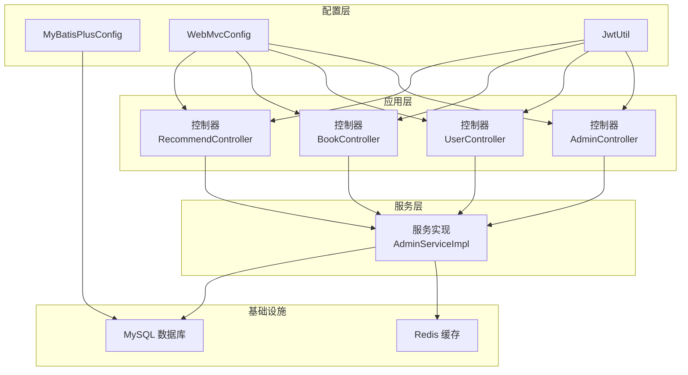
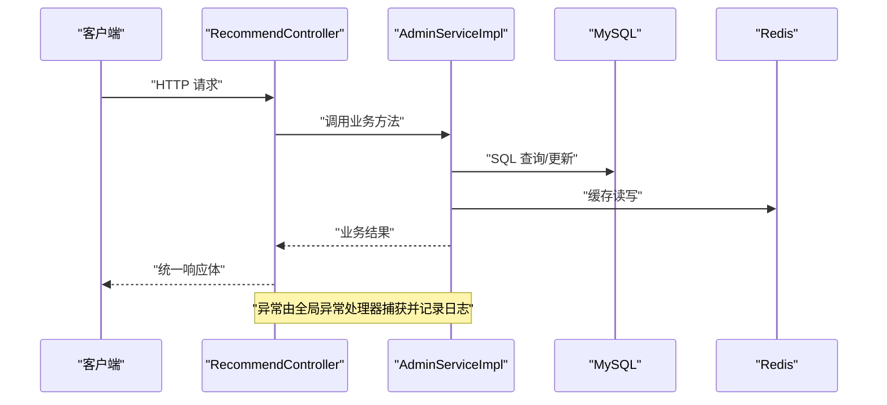
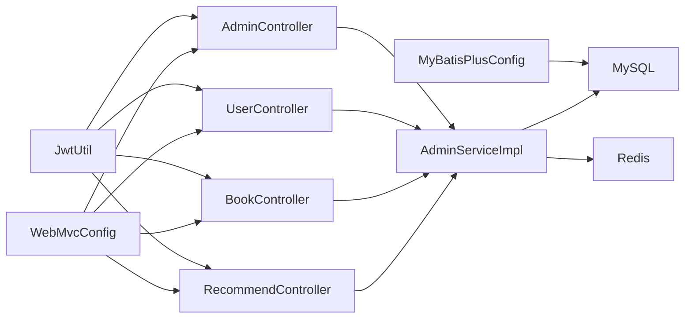

# 监控告警

<cite>
**本文引用的文件**
- [application.yml](file://src/main/resources/application.yml)
- [pom.xml](file://pom.xml)
- [BackendApplication.java](file://src/main/java/org/example/backend/BackendApplication.java)
- [GlobalExceptionHandler.java](file://src/main/java/org/example/backend/common/exception/GlobalExceptionHandler.java)
- [ApiResponse.java](file://src/main/java/org/example/backend/common/ApiResponse.java)
- [MyBatisPlusConfig.java](file://src/main/java/org/example/backend/config/MyBatisPlusConfig.java)
- [WebMvcConfig.java](file://src/main/java/org/example/backend/config/WebMvcConfig.java)
- [JwtUtil.java](file://src/main/java/org/example/backend/config/JwtUtil.java)
- [RecommendController.java](file://src/main/java/org/example/backend/modules/recommend/controller/RecommendController.java)
- [BookController.java](file://src/main/java/org/example/backend/modules/book/controller/BookController.java)
- [UserController.java](file://src/main/java/org/example/backend/modules/user/controller/UserController.java)
- [AdminController.java](file://src/main/java/org/example/backend/modules/admin/controller/AdminController.java)
- [AdminServiceImpl.java](file://src/main/java/org/example/backend/modules/admin/service/impl/AdminServiceImpl.java)
- [SystemConfig.java](file://src/main/java/org/example/backend/entity/SystemConfig.java)
- [SystemConfigMapper.java](file://src/main/java/org/example/backend/modules/admin/repository/SystemConfigMapper.java)
- [data_library126_db.sql](file://src/main/resources/data_library126_db.sql)
- [DashboardVO.java](file://src/main/java/org/example/backend/vo/admin/DashboardVO.java)
- [RecommendFunnelVO.java](file://src/main/java/org/example/backend/vo/admin/RecommendFunnelVO.java)
- [StatPointVO.java](file://src/main/java/org/example/backend/vo/admin/StatPointVO.java)
</cite>

## 目录
1. [简介](#简介)
2. [项目结构](#项目结构)
3. [核心组件](#核心组件)
4. [架构总览](#架构总览)
5. [详细组件分析](#详细组件分析)
6. [依赖关系分析](#依赖关系分析)
7. [性能考量](#性能考量)
8. [故障排查指南](#故障排查指南)
9. [结论](#结论)
10. [附录](#附录)

## 简介
本文件面向运维团队，提供智能图书推荐系统的监控告警完整方案。内容涵盖应用性能监控指标配置与采集、数据库连接池监控、Redis性能监控、API响应时间监控、Prometheus与Grafana集成、告警规则设定、日志聚合与ELK Stack集成以及关键业务指标监控。目标是帮助团队快速搭建稳定可靠的监控体系，并明确告警处理流程。

## 项目结构
后端采用Spring Boot工程，模块化组织业务功能，统一异常处理与响应封装，配置集中于application.yml，数据库连接与Redis连接通过Spring Boot Starter自动装配。

图表来源
- [RecommendController.java](file://src/main/java/org/example/backend/modules/recommend/controller/RecommendController.java#L1-L130)
- [BookController.java](file://src/main/java/org/example/backend/modules/book/controller/BookController.java#L1-L60)
- [UserController.java](file://src/main/java/org/example/backend/modules/user/controller/UserController.java#L1-L219)
- [AdminController.java](file://src/main/java/org/example/backend/modules/admin/controller/AdminController.java#L83-L117)
- [AdminServiceImpl.java](file://src/main/java/org/example/backend/modules/admin/service/impl/AdminServiceImpl.java#L316-L336)
- [MyBatisPlusConfig.java](file://src/main/java/org/example/backend/config/MyBatisPlusConfig.java#L1-L28)
- [WebMvcConfig.java](file://src/main/java/org/example/backend/config/WebMvcConfig.java#L1-L29)
- [JwtUtil.java](file://src/main/java/org/example/backend/config/JwtUtil.java#L1-L47)

章节来源
- [application.yml](file://src/main/resources/application.yml#L1-L71)
- [pom.xml](file://pom.xml#L1-L161)

## 核心组件
- 应用启动与运行
  - 启动入口位于应用根包，负责加载Spring上下文与自动配置。
- 统一异常处理
  - 全局异常处理器对业务异常、参数校验异常、认证/授权异常进行分类处理，并记录日志。
- 统一响应封装
  - 统一响应体封装了响应码、消息与数据，便于前端与监控系统解析。
- 配置中心
  - 数据库连接、Redis连接、JWT密钥与过期时间、Swagger、文件上传路径等均在配置文件中集中管理。
- 业务监控数据
  - 管理端仪表盘提供馆藏周转率、推荐点击率、活跃用户数等关键指标；系统配置表用于动态控制缓存开关与TTL等。

章节来源
- [BackendApplication.java](file://src/main/java/org/example/backend/BackendApplication.java#L1-L13)
- [GlobalExceptionHandler.java](file://src/main/java/org/example/backend/common/exception/GlobalExceptionHandler.java#L1-L111)
- [ApiResponse.java](file://src/main/java/org/example/backend/common/ApiResponse.java#L1-L89)
- [application.yml](file://src/main/resources/application.yml#L1-L71)
- [SystemConfig.java](file://src/main/java/org/example/backend/entity/SystemConfig.java#L1-L48)
- [SystemConfigMapper.java](file://src/main/java/org/example/backend/modules/admin/repository/SystemConfigMapper.java#L1-L13)
- [data_library126_db.sql](file://src/main/resources/data_library126_db.sql#L831-L852)
- [DashboardVO.java](file://src/main/java/org/example/backend/vo/admin/DashboardVO.java#L1-L31)

## 架构总览
下图展示监控相关的关键交互：控制器接收请求，服务层执行业务逻辑并访问数据库与Redis，异常处理器统一捕获异常并记录日志，配置层提供连接与参数。

图表来源
- [RecommendController.java](file://src/main/java/org/example/backend/modules/recommend/controller/RecommendController.java#L27-L39)
- [AdminServiceImpl.java](file://src/main/java/org/example/backend/modules/admin/service/impl/AdminServiceImpl.java#L316-L336)
- [GlobalExceptionHandler.java](file://src/main/java/org/example/backend/common/exception/GlobalExceptionHandler.java#L33-L38)

## 详细组件分析

### 数据库连接池监控
- 连接池配置
  - 数据源驱动、URL、用户名、密码在配置文件中集中定义；MyBatis-Plus分页插件在配置类中启用。
- 监控建议
  - 使用Spring Boot Actuator暴露数据库连接池指标（如HikariCP），结合Prometheus抓取。
  - 关注连接池活跃连接数、空闲连接数、等待队列长度、连接超时次数等。
- 采集范围
  - 通过Actuator端点暴露的JMX指标或Micrometer指标，Prometheus定期拉取。

章节来源
- [application.yml](file://src/main/resources/application.yml#L10-L30)
- [MyBatisPlusConfig.java](file://src/main/java/org/example/backend/config/MyBatisPlusConfig.java#L1-L28)

### Redis性能监控
- 连接与池化
  - Redis主机、端口、密码、数据库索引、超时与Lettuce连接池参数在配置文件中定义。
- 动态配置
  - 系统配置表存储“缓存开关”和“TTL”，服务层按需读取并更新。
- 监控建议
  - 抓取Redis命令耗时、命中率、内存使用、连接数、阻塞客户端数量等。
  - 结合系统配置项动态调整缓存策略，避免过度缓存导致内存压力。

章节来源
- [application.yml](file://src/main/resources/application.yml#L31-L43)
- [SystemConfig.java](file://src/main/java/org/example/backend/entity/SystemConfig.java#L1-L48)
- [SystemConfigMapper.java](file://src/main/java/org/example/backend/modules/admin/repository/SystemConfigMapper.java#L1-L13)
- [AdminServiceImpl.java](file://src/main/java/org/example/backend/modules/admin/service/impl/AdminServiceImpl.java#L344-L406)
- [data_library126_db.sql](file://src/main/resources/data_library126_db.sql#L831-L852)

### API响应时间监控
- 控制器层
  - 所有控制器方法返回统一响应体，便于在网关或代理层统计端到端延迟。
- 监控建议
  - 在网关或反向代理层记录请求开始时间与结束时间，计算响应时间直方图。
  - 对关键接口（如推荐、图书详情、用户信息）单独建立SLA阈值。
- 错误率监控
  - 统计HTTP 5xx错误占比，结合全局异常处理器记录的异常类型进行归因。

章节来源
- [RecommendController.java](file://src/main/java/org/example/backend/modules/recommend/controller/RecommendController.java#L27-L39)
- [BookController.java](file://src/main/java/org/example/backend/modules/book/controller/BookController.java#L51-L57)
- [UserController.java](file://src/main/java/org/example/backend/modules/user/controller/UserController.java#L32-L41)
- [ApiResponse.java](file://src/main/java/org/example/backend/common/ApiResponse.java#L1-L89)
- [GlobalExceptionHandler.java](file://src/main/java/org/example/backend/common/exception/GlobalExceptionHandler.java#L103-L108)

### Prometheus与Grafana集成
- 指标定义
  - JVM堆/非堆内存、线程数、GC时间、类加载数。
  - 数据库连接池指标（活跃连接、空闲连接、等待队列长度）。
  - Redis指标（命令耗时、命中率、内存使用、连接数）。
  - 自定义业务指标（馆藏周转率、推荐点击率、活跃用户数、系统告警数）。
- 抓取配置
  - Prometheus定期从Actuator端点拉取指标，确保端点暴露且可访问。
- 仪表板
  - Grafana仪表板包含：系统健康、数据库与Redis健康、API延迟与错误率、业务指标趋势。

章节来源
- [application.yml](file://src/main/resources/application.yml#L1-L71)
- [pom.xml](file://pom.xml#L1-L161)

### 告警规则设置
- CPU使用率
  - 阈值：5分钟平均超过85%，持续3个周期触发预警；超过95%触发严重告警。
- 内存占用
  - 阈值：堆内存使用率超过80%，持续5分钟触发预警；超过90%触发严重告警。
- 数据库连接数
  - 阈值：活跃连接占最大连接数比例超过80%，持续3分钟触发预警；超过90%触发严重告警。
- 错误率
  - 阈值：API错误率（5xx）超过2%，持续5分钟触发预警；超过5%触发严重告警。
- 缓存可用性
  - 阈值：Redis不可用或命令耗时P95超过100ms，触发告警。

章节来源
- [GlobalExceptionHandler.java](file://src/main/java/org/example/backend/common/exception/GlobalExceptionHandler.java#L33-L38)
- [AdminServiceImpl.java](file://src/main/java/org/example/backend/modules/admin/service/impl/AdminServiceImpl.java#L316-L336)

### 日志聚合与ELK集成
- 日志级别
  - 根日志级别为INFO，业务包与安全相关包提升至DEBUG，便于问题定位。
- ELK栈
  - 使用Logstash或Filebeat采集应用日志，Elasticsearch存储，Kibana可视化。
  - 建议字段：时间戳、日志级别、线程名、Logger名称、消息正文、异常堆栈。
- 关键日志
  - 全局异常处理器记录的业务异常、认证失败、权限不足、系统异常等。

章节来源
- [application.yml](file://src/main/resources/application.yml#L63-L71)
- [GlobalExceptionHandler.java](file://src/main/java/org/example/backend/common/exception/GlobalExceptionHandler.java#L33-L38)

### 关键业务指标监控
- 仪表盘指标
  - 馆藏周转率：总借阅数/总藏书数。
  - 推荐点击率：推荐曝光/点击。
  - 活跃用户数（DAU）：最近7天有借阅行为的用户数。
  - 系统告警数：当前系统告警总数。
- 漏斗指标
  - 推荐漏斗：曝光→点击→收藏→评分，计算各阶段转化率。
- 配置项
  - 缓存开关与TTL、模型版本等通过系统配置表动态管理。

章节来源
- [AdminServiceImpl.java](file://src/main/java/org/example/backend/modules/admin/service/impl/AdminServiceImpl.java#L316-L336)
- [AdminServiceImpl.java](file://src/main/java/org/example/backend/modules/admin/service/impl/AdminServiceImpl.java#L744-L763)
- [DashboardVO.java](file://src/main/java/org/example/backend/vo/admin/DashboardVO.java#L1-L31)
- [RecommendFunnelVO.java](file://src/main/java/org/example/backend/vo/admin/RecommendFunnelVO.java#L1-L19)
- [SystemConfig.java](file://src/main/java/org/example/backend/entity/SystemConfig.java#L1-L48)
- [SystemConfigMapper.java](file://src/main/java/org/example/backend/modules/admin/repository/SystemConfigMapper.java#L1-L13)

## 依赖关系分析
- 组件耦合
  - 控制器依赖服务层；服务层依赖数据访问层与外部缓存；配置类贯穿数据源与Web资源处理。
- 外部依赖
  - MySQL驱动、MyBatis-Plus、Redis Starter、JWT、Swagger等。
- 循环依赖
  - 当前结构清晰，未发现循环依赖迹象。

图表来源
- [RecommendController.java](file://src/main/java/org/example/backend/modules/recommend/controller/RecommendController.java#L1-L130)
- [BookController.java](file://src/main/java/org/example/backend/modules/book/controller/BookController.java#L1-L60)
- [UserController.java](file://src/main/java/org/example/backend/modules/user/controller/UserController.java#L1-L219)
- [AdminController.java](file://src/main/java/org/example/backend/modules/admin/controller/AdminController.java#L83-L117)
- [AdminServiceImpl.java](file://src/main/java/org/example/backend/modules/admin/service/impl/AdminServiceImpl.java#L316-L336)
- [MyBatisPlusConfig.java](file://src/main/java/org/example/backend/config/MyBatisPlusConfig.java#L1-L28)
- [WebMvcConfig.java](file://src/main/java/org/example/backend/config/WebMvcConfig.java#L1-L29)
- [JwtUtil.java](file://src/main/java/org/example/backend/config/JwtUtil.java#L1-L47)

章节来源
- [pom.xml](file://pom.xml#L19-L115)

## 性能考量
- 连接池与缓存
  - 合理设置数据库连接池大小与Redis连接池参数，避免资源争用。
- API延迟
  - 对热点接口增加缓存与异步化，降低数据库压力。
- 日志开销
  - 生产环境避免高频DEBUG日志，必要时使用采样或分级输出。
- 监控开销
  - 指标采集频率与保留周期需平衡可观测性与存储成本。

## 故障排查指南
- 快速定位
  - 通过Kibana查看异常日志，结合全局异常处理器记录的异常类型与消息。
- 常见问题
  - 认证失败：检查JWT密钥与过期时间配置。
  - 权限不足：确认用户角色与访问路径权限。
  - 业务异常：根据业务异常码与消息定位具体业务逻辑。
- 处理流程
  - 发现告警→查看Grafana仪表板→核对ELK日志→定位异常代码→修复并验证→关闭告警。

章节来源
- [GlobalExceptionHandler.java](file://src/main/java/org/example/backend/common/exception/GlobalExceptionHandler.java#L82-L98)
- [JwtUtil.java](file://src/main/java/org/example/backend/config/JwtUtil.java#L21-L25)

## 结论
通过统一异常处理、集中配置与业务指标封装，本系统具备良好的可观测性基础。结合Prometheus/Grafana与ELK Stack，可实现从基础设施到业务层面的全链路监控与告警。建议尽快落地Actuator指标暴露、数据库与Redis指标采集、关键API延迟与错误率监控，并完善告警规则与处理流程。

## 附录
- 配置清单
  - 数据库连接：驱动、URL、用户名、密码。
  - Redis连接：主机、端口、密码、数据库、超时、连接池参数。
  - JWT：密钥、过期时间。
  - Swagger：OpenAPI文档与UI路径。
  - 文件上传：本地路径与访问前缀。
- 依赖清单
  - Spring Boot Web、Security、Validation、MyBatis-Plus、Redis、JWT、Swagger、Jackson、Hutool等。

章节来源
- [application.yml](file://src/main/resources/application.yml#L1-L71)
- [pom.xml](file://pom.xml#L19-L115)