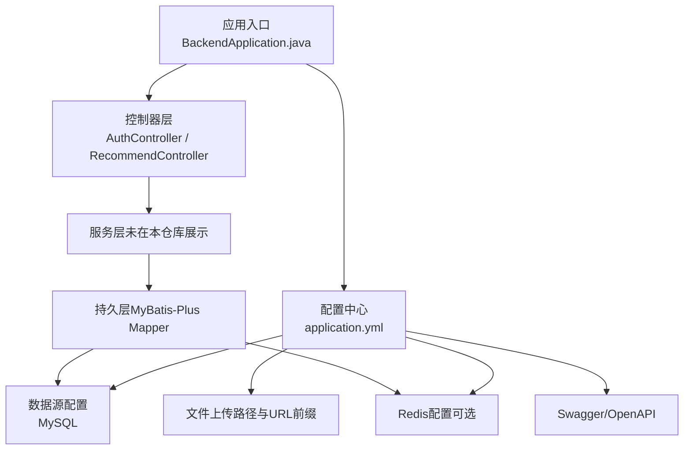
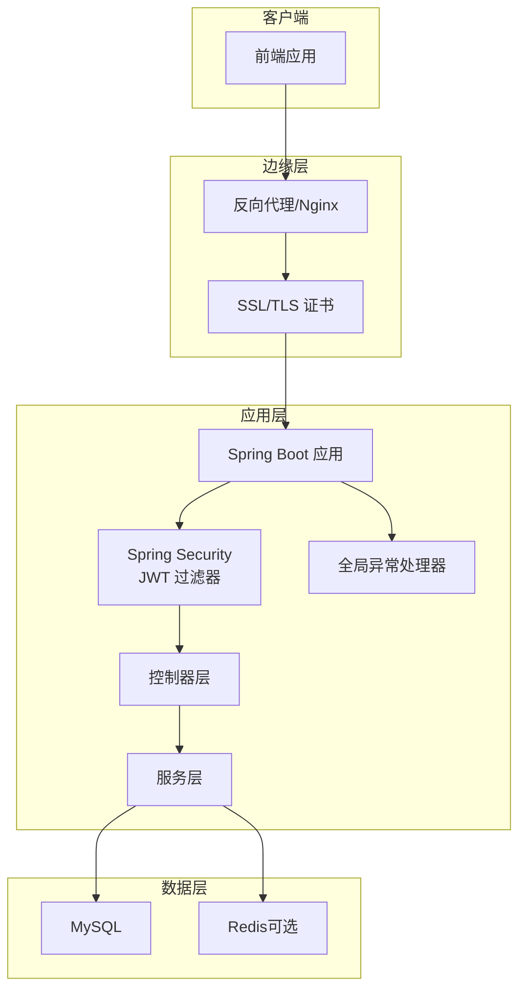
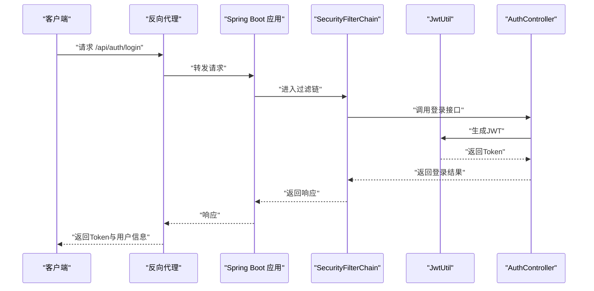
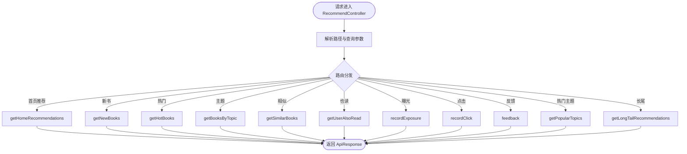
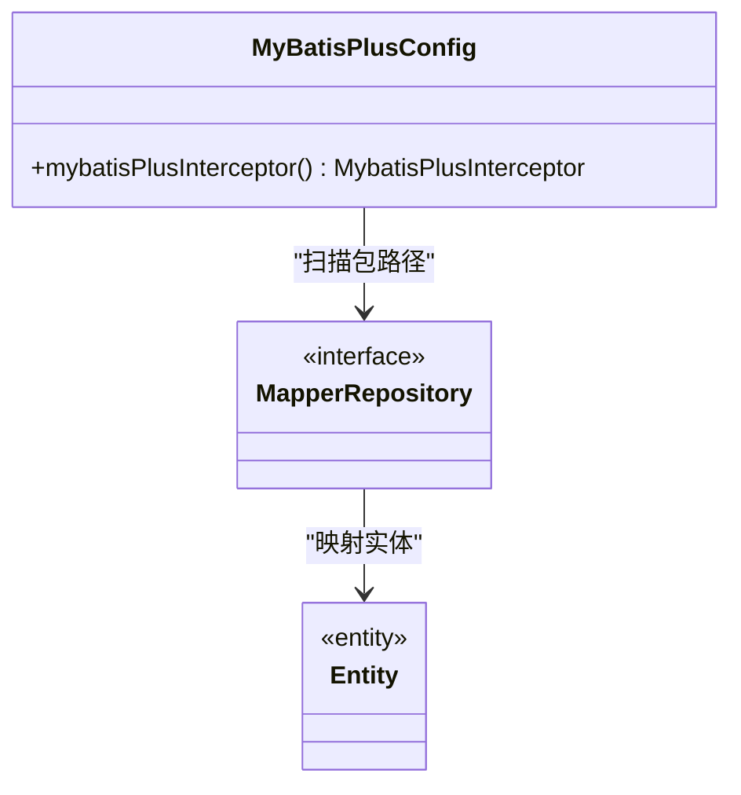
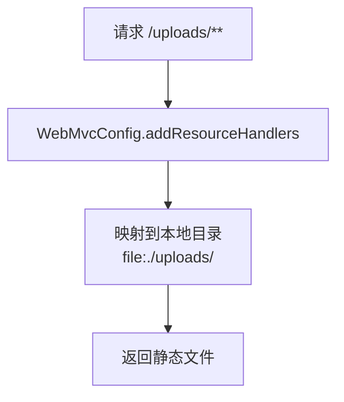
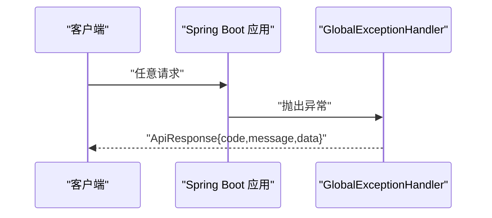
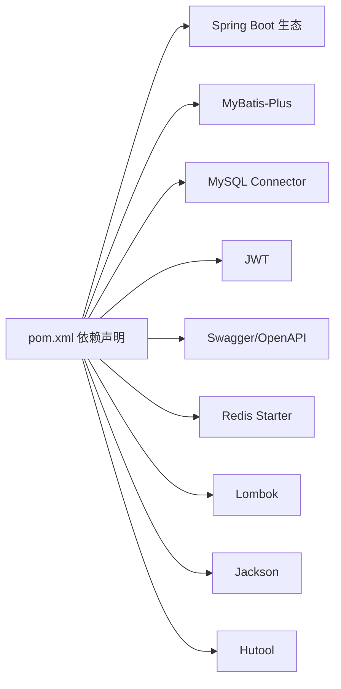

# 部署运维

<cite>
**本文引用的文件**
- [pom.xml](file://pom.xml)
- [application.yml](file://src/main/resources/application.yml)
- [BackendApplication.java](file://src/main/java/org/example/backend/BackendApplication.java)
- [data_library126_db.sql](file://src/main/resources/data_library126_db.sql)
- [MyBatisPlusConfig.java](file://src/main/java/org/example/backend/config/MyBatisPlusConfig.java)
- [WebMvcConfig.java](file://src/main/java/org/example/backend/config/WebMvcConfig.java)
- [SecurityConfig.java](file://src/main/java/org/example/backend/config/SecurityConfig.java)
- [JwtUtil.java](file://src/main/java/org/example/backend/config/JwtUtil.java)
- [AuthController.java](file://src/main/java/org/example/backend/modules/auth/controller/AuthController.java)
- [RecommendController.java](file://src/main/java/org/example/backend/modules/recommend/controller/RecommendController.java)
- [GlobalExceptionHandler.java](file://src/main/java/org/example/backend/common/exception/GlobalExceptionHandler.java)
</cite>

## 目录
1. [简介](#简介)
2. [项目结构](#项目结构)
3. [核心组件](#核心组件)
4. [架构总览](#架构总览)
5. [详细组件分析](#详细组件分析)
6. [依赖分析](#依赖分析)
7. [性能考虑](#性能考虑)
8. [故障排查指南](#故障排查指南)
9. [结论](#结论)
10. [附录](#附录)

## 简介
本部署运维文档面向生产环境，围绕智能图书推荐系统的部署与运维展开，涵盖以下内容：
- 生产环境部署流程与自动化策略
- Docker 容器化配置建议
- 环境配置管理、数据库迁移与版本升级流程
- 服务器环境准备、域名与 SSL 证书安装、反向代理设置
- 监控告警、日志收集与分析、故障排查
- 备份恢复策略、容量规划与性能监控方案
- 运维手册与应急响应预案

## 项目结构
该后端采用 Spring Boot 单体应用，模块化组织清晰，核心配置集中在 resources 下的 application.yml，数据库初始化脚本位于 resources 目录，安全与 MyBatis-Plus 配置分别在 config 包下。

图表来源
- [BackendApplication.java](file://src/main/java/org/example/backend/BackendApplication.java#L1-L14)
- [application.yml](file://src/main/resources/application.yml#L1-L71)
- [AuthController.java](file://src/main/java/org/example/backend/modules/auth/controller/AuthController.java#L1-L41)
- [RecommendController.java](file://src/main/java/org/example/backend/modules/recommend/controller/RecommendController.java#L1-L130)

章节来源
- [BackendApplication.java](file://src/main/java/org/example/backend/BackendApplication.java#L1-L14)
- [application.yml](file://src/main/resources/application.yml#L1-L71)

## 核心组件
- 应用入口与打包
  - 启动类位于 org.example.backend.BackendApplication，使用 Maven 插件指定主类进行 repackage。
- 配置中心
  - application.yml 提供 server、spring.datasource、mybatis-plus、redis、jwt、springdoc、file.upload、logging 等配置项。
- 安全与鉴权
  - 基于 Spring Security 的无状态认证，CORS 放通，公开接口白名单，管理员接口需 ADMIN 角色。
- 推荐与认证控制器
  - 提供首页推荐、新书、热门、主题漫游、相似推荐、曝光/点击/反馈等接口；认证接口支持注册与登录。
- 异常处理
  - 全局异常处理器统一返回 ApiResponse 结构，区分业务异常、参数校验异常、认证/授权异常与系统异常。

章节来源
- [pom.xml](file://pom.xml#L140-L156)
- [application.yml](file://src/main/resources/application.yml#L1-L71)
- [SecurityConfig.java](file://src/main/java/org/example/backend/config/SecurityConfig.java#L46-L81)
- [AuthController.java](file://src/main/java/org/example/backend/modules/auth/controller/AuthController.java#L26-L38)
- [RecommendController.java](file://src/main/java/org/example/backend/modules/recommend/controller/RecommendController.java#L27-L127)
- [GlobalExceptionHandler.java](file://src/main/java/org/example/backend/common/exception/GlobalExceptionHandler.java#L33-L108)

## 架构总览
系统采用前后端分离，后端提供 REST API，前端通过反向代理访问。推荐与认证为核心业务模块，MyBatis-Plus 负责数据访问，Redis 可用于缓存（可选），JWT 实现无状态鉴权。

图表来源
- [SecurityConfig.java](file://src/main/java/org/example/backend/config/SecurityConfig.java#L46-L81)
- [JwtUtil.java](file://src/main/java/org/example/backend/config/JwtUtil.java#L30-L42)
- [application.yml](file://src/main/resources/application.yml#L11-L43)
- [RecommendController.java](file://src/main/java/org/example/backend/modules/recommend/controller/RecommendController.java#L27-L127)
- [AuthController.java](file://src/main/java/org/example/backend/modules/auth/controller/AuthController.java#L26-L38)
- [GlobalExceptionHandler.java](file://src/main/java/org/example/backend/common/exception/GlobalExceptionHandler.java#L33-L108)

## 详细组件分析

### 安全与鉴权（Spring Security + JWT）
- 无状态会话：禁用 CSRF，SessionCreationPolicy 设为 STATELESS。
- CORS 放通：允许任意 Origin、方法与头，支持凭据，预检缓存 1 小时。
- 接口放行：认证、Swagger、公开搜索/详情/推荐、静态资源等无需认证。
- 管理员接口：/api/admin/** 需要 ADMIN 角色。
- JWT 生成与校验：基于 HS256，密钥与过期时间来自配置，提供解析 userId 与 role 的能力。

图表来源
- [SecurityConfig.java](file://src/main/java/org/example/backend/config/SecurityConfig.java#L46-L81)
- [JwtUtil.java](file://src/main/java/org/example/backend/config/JwtUtil.java#L30-L42)
- [AuthController.java](file://src/main/java/org/example/backend/modules/auth/controller/AuthController.java#L33-L38)

章节来源
- [SecurityConfig.java](file://src/main/java/org/example/backend/config/SecurityConfig.java#L46-L98)
- [JwtUtil.java](file://src/main/java/org/example/backend/config/JwtUtil.java#L21-L89)

### 推荐服务（推荐控制器）
- 接口覆盖首页推荐、新书、热门、主题、相似、也读、曝光/点击/反馈、热门主题、长尾推荐等。
- 用户上下文：通过 UserContext 获取当前用户 ID，用于记录曝光、点击与反馈。
- 参数校验：使用 Spring Validation，配合全局异常处理器统一返回。

图表来源
- [RecommendController.java](file://src/main/java/org/example/backend/modules/recommend/controller/RecommendController.java#L27-L127)

章节来源
- [RecommendController.java](file://src/main/java/org/example/backend/modules/recommend/controller/RecommendController.java#L27-L127)

### 数据访问与分页（MyBatis-Plus）
- Mapper 扫描路径：org.example.backend.modules.*.repository。
- 分页插件：针对 MySQL 的 PaginationInnerInterceptor。
- 逻辑删除字段：deleted，未删除值为 0，已删除值为 1。

图表来源
- [MyBatisPlusConfig.java](file://src/main/java/org/example/backend/config/MyBatisPlusConfig.java#L14-L25)

章节来源
- [MyBatisPlusConfig.java](file://src/main/java/org/example/backend/config/MyBatisPlusConfig.java#L14-L25)
- [application.yml](file://src/main/resources/application.yml#L18-L29)

### 文件上传与静态资源
- 文件上传路径与 URL 前缀由配置项控制，默认相对路径 ./uploads 与 /uploads。
- WebMvc 配置将 /uploads/** 映射到本地文件系统，便于静态资源访问。

图表来源
- [WebMvcConfig.java](file://src/main/java/org/example/backend/config/WebMvcConfig.java#L20-L25)
- [application.yml](file://src/main/resources/application.yml#L58-L61)

章节来源
- [WebMvcConfig.java](file://src/main/java/org/example/backend/config/WebMvcConfig.java#L14-L25)
- [application.yml](file://src/main/resources/application.yml#L58-L61)

### 全局异常处理
- 统一返回 ApiResponse，区分业务异常、参数校验异常、认证/授权异常与系统异常。
- 日志记录：对不同异常级别进行 warn/error 输出，便于审计与排查。

图表来源
- [GlobalExceptionHandler.java](file://src/main/java/org/example/backend/common/exception/GlobalExceptionHandler.java#L33-L108)

章节来源
- [GlobalExceptionHandler.java](file://src/main/java/org/example/backend/common/exception/GlobalExceptionHandler.java#L25-L108)

## 依赖分析
- 核心框架与组件
  - Spring Boot Web、Validation、Security、Test、Security-Test
  - MyBatis-Plus Starter
  - MySQL Connector
  - JWT（API/Impl/Jackson）
  - Swagger/OpenAPI
  - Redis Starter（可选）
  - Lombok、Jackson、Hutool
- 构建与打包
  - Maven 编译插件与 Spring Boot Maven 插件，指定主类为 org.example.backend.BackendApplication。

图表来源
- [pom.xml](file://pom.xml#L19-L114)

章节来源
- [pom.xml](file://pom.xml#L19-L156)

## 性能考虑
- 数据库连接与并发
  - 建议在生产环境调整连接池大小、超时时间与隔离级别，结合慢查询日志优化 SQL。
- 缓存策略
  - 若启用 Redis，建议对热点数据与接口结果进行缓存，设置合理 TTL，避免缓存穿透与雪崩。
- 推荐算法与分页
  - 对复杂推荐查询增加索引与分页限制，避免一次性返回过多数据。
- 日志与监控
  - 控制台输出仅用于开发，生产环境建议接入集中式日志平台，开启采样与脱敏。
- JVM 与容器
  - 设置合理的堆大小、GC 参数与容器资源限制，结合健康检查与就绪探针。

## 故障排查指南
- 认证失败
  - 检查用户名/密码是否正确，确认 Security 放行规则与 JWT 密钥配置。
- 权限不足
  - 确认用户角色是否包含 ADMIN，检查 /api/admin/** 的访问控制。
- 参数校验失败
  - 查看全局异常返回的字段错误提示，修正请求参数。
- 数据库连接问题
  - 核对 application.yml 中的数据库 URL、用户名、密码与时区设置。
- 文件上传失败
  - 检查上传目录权限与 URL 前缀配置，确认 WebMvc 静态资源映射生效。
- 推荐接口异常
  - 关注推荐服务日志与数据库慢查询，定位具体 Mapper 与 SQL。

章节来源
- [GlobalExceptionHandler.java](file://src/main/java/org/example/backend/common/exception/GlobalExceptionHandler.java#L43-L108)
- [SecurityConfig.java](file://src/main/java/org/example/backend/config/SecurityConfig.java#L52-L78)
- [application.yml](file://src/main/resources/application.yml#L11-L15)
- [WebMvcConfig.java](file://src/main/java/org/example/backend/config/WebMvcConfig.java#L20-L25)

## 结论
本运维文档提供了从部署到运维的完整实践指南。建议在生产环境中严格区分配置文件、完善监控与日志体系、制定数据库迁移与版本升级流程，并建立完善的备份与应急响应机制，确保系统稳定、可扩展与可维护。

## 附录

### A. 生产环境部署流程
- 服务器准备
  - 操作系统：Linux（推荐 CentOS/Ubuntu）
  - Java：JDK 8（项目使用 1.8）
  - 数据库：MySQL 8.0+，初始化 data_library126_db.sql
  - 可选：Redis 6.0+
- 环境变量与配置
  - 使用环境变量覆盖 application.yml 中敏感配置（如数据库密码、JWT 密钥）
  - 日志输出至文件并接入集中式日志平台
- 构建与发布
  - 使用 Maven 打包生成可执行 JAR，或构建 Docker 镜像
- 启动与健康检查
  - 使用 systemd 或 Docker Compose 管理进程，配置健康检查与自动重启
- 反向代理与域名
  - Nginx 作为反向代理，配置域名与 HTTPS（Let’s Encrypt）
- 自动化部署
  - CI/CD 流水线：构建 → 单元测试 → 打包 → 部署 → 健康检查 → 回滚策略

### B. Docker 容器化配置建议
- Dockerfile
  - 基础镜像：openjdk:8-jre-alpine
  - 复制 JAR 到 /app/backend.jar
  - 暴露端口：9090
  - CMD 启动命令：java -jar /app/backend.jar
- docker-compose.yml
  - 服务：backend、mysql、redis（可选）
  - 网络与卷：挂载日志目录与上传目录
  - 环境变量：覆盖敏感配置
- 健康检查
  - GET /actuator/health
- 证书与反代
  - 使用 Traefik 或 Nginx 反代，自动续签 Let’s Encrypt 证书

### C. 环境配置管理
- 开发/测试/生产三套配置文件，通过 spring.profiles.active 切换
- 敏感信息使用密文存储（如 Vault/KMS），避免硬编码
- 配置热更新：对非敏感配置启用 RefreshScope（需 Actuator）

### D. 数据库迁移与版本升级
- 迁移策略
  - 使用 Flyway/Liquibase 或自定义脚本，按版本号顺序执行
  - 升级前备份，升级后验证数据一致性
- 版本回滚
  - 保留上一版本备份，回滚脚本与数据快照
- 初始化脚本
  - data_library126_db.sql 用于首次初始化，生产环境建议拆分为结构与数据两部分

### E. 监控告警与日志
- 指标采集
  - JVM 指标：内存、GC、线程
  - 应用指标：接口 QPS、延迟、错误率、数据库连接数
- 日志
  - 结构化日志，按天切割，保留 30 天
  - 关键字段：traceId、userId、接口名、耗时、状态码
- 告警
  - 错误率阈值、P95 延迟阈值、数据库连接池耗尽、磁盘空间告警

### F. 备份恢复与容量规划
- 备份
  - 数据库：每日全备 + 增量备份，异地容灾
  - 文件：上传目录定期归档
- 恢复演练
  - 定期进行 RTO/RPO 验证
- 容量规划
  - 评估峰值 QPS、存储增长、缓存命中率，预留 30% 资源冗余

### G. 应急响应预案
- 常见事件
  - 数据库不可用、接口大面积 5xx、推荐算法异常、文件上传失败
- 处置流程
  - 快速隔离、降级开关、回滚至上一版本、扩容与修复
- 沟通机制
  - 事件分级、责任人、通知渠道与升级机制