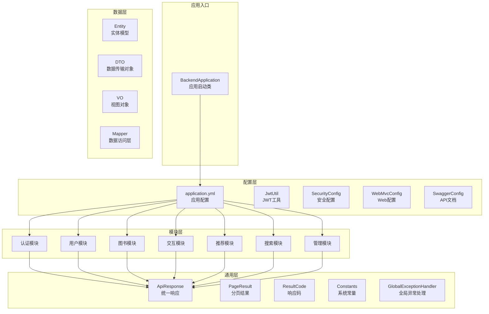
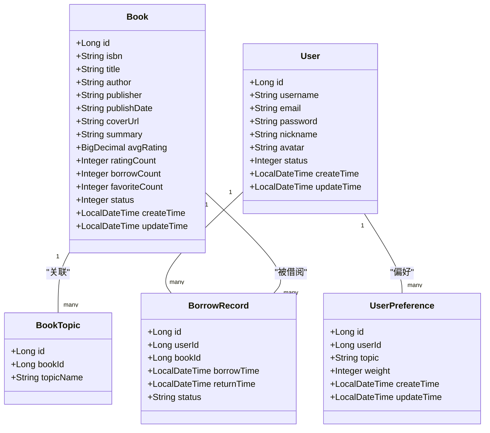
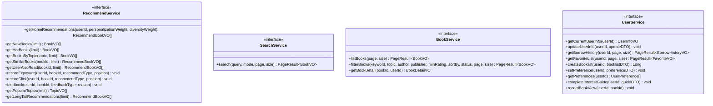
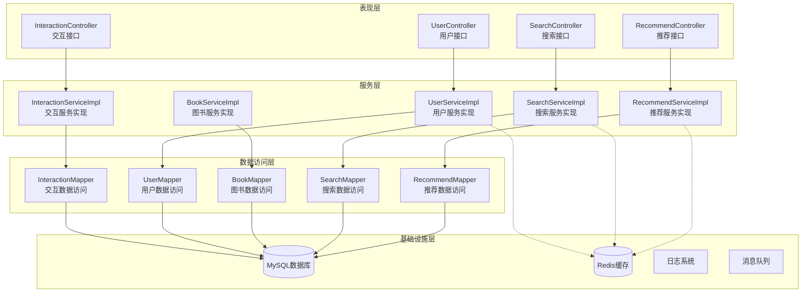
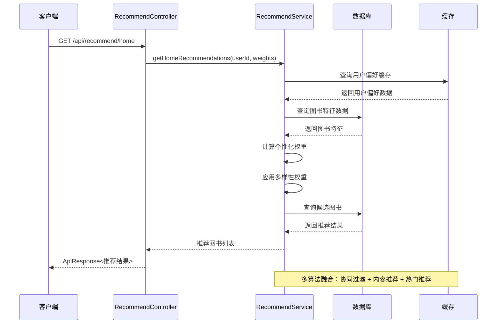
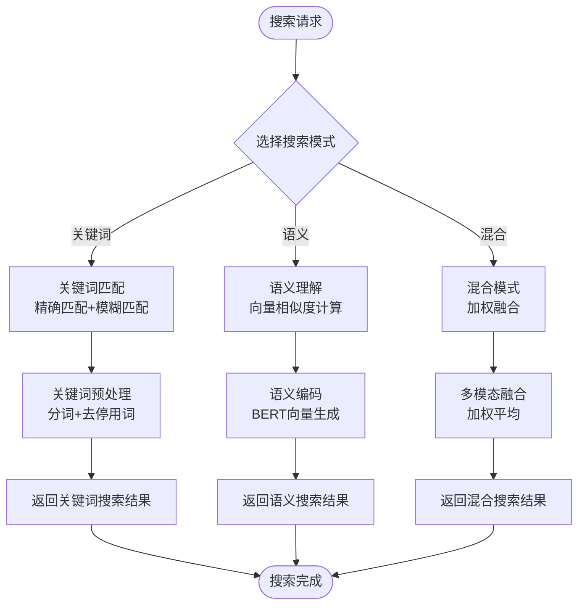
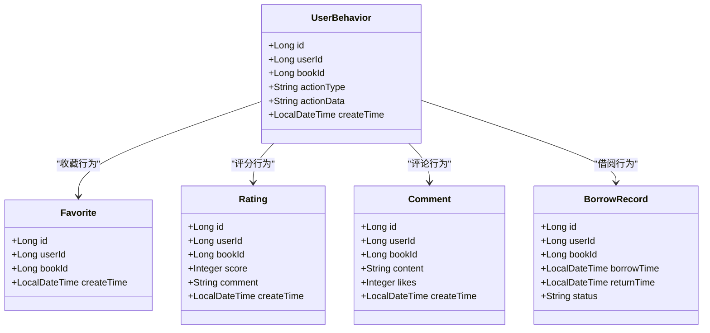
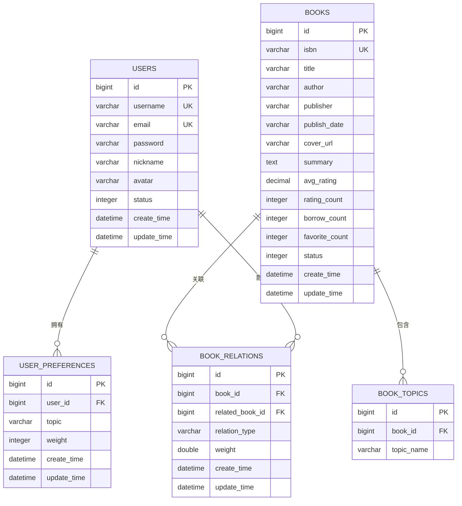
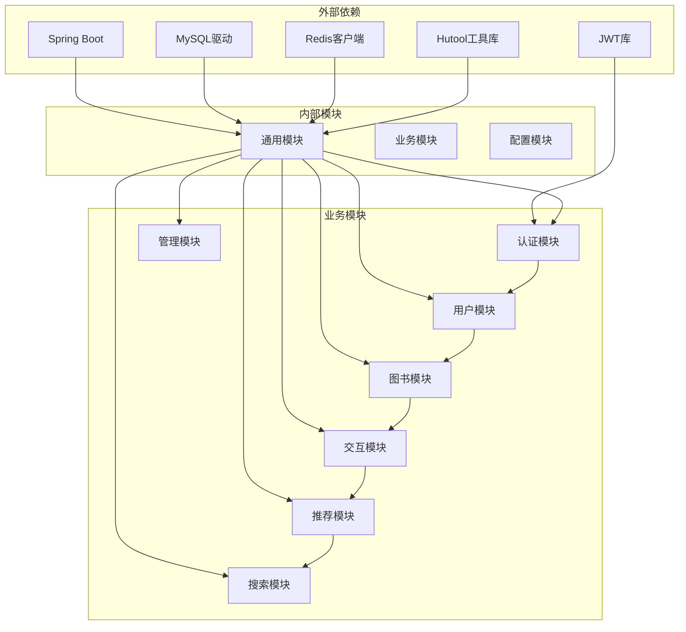
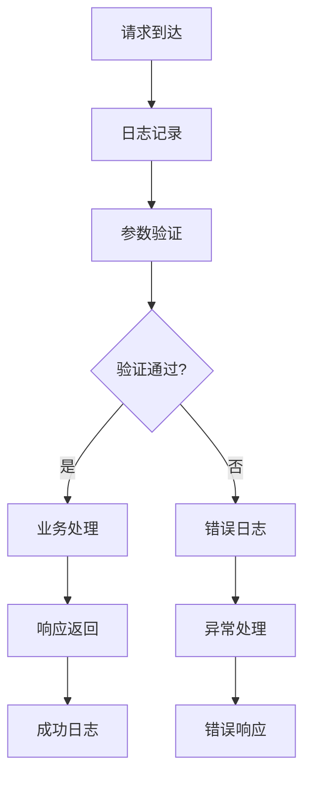

# 项目概述

<cite>
**本文档引用的文件**
- [BackendApplication.java](file://src/main/java/org/example/backend/BackendApplication.java)
- [application.yml](file://src/main/resources/application.yml)
- [pom.xml](file://pom.xml)
- [Constants.java](file://src/main/java/org/example/backend/common/constants/Constants.java)
- [Book.java](file://src/main/java/org/example/backend/entity/Book.java)
- [User.java](file://src/main/java/org/example/backend/entity/User.java)
- [RecommendService.java](file://src/main/java/org/example/backend/modules/recommend/service/RecommendService.java)
- [SearchService.java](file://src/main/java/org/example/backend/modules/search/service/SearchService.java)
- [RecommendController.java](file://src/main/java/org/example/backend/modules/recommend/controller/RecommendController.java)
- [SearchController.java](file://src/main/java/org/example/backend/modules/search/controller/SearchController.java)
- [BookService.java](file://src/main/java/org/example/backend/modules/book/service/BookService.java)
- [UserService.java](file://src/main/java/org/example/backend/modules/user/service/UserService.java)
- [WebMvcConfig.java](file://src/main/java/org/example/backend/config/WebMvcConfig.java)
- [GlobalExceptionHandler.java](file://src/main/java/org/example/backend/common/exception/GlobalExceptionHandler.java)
- [ApiResponse.java](file://src/main/java/org/example/backend/common/ApiResponse.java)
- [data_library126_db.sql](file://src/main/resources/data_library126_db.sql)
</cite>

## 目录
1. [引言](#引言)
2. [项目结构](#项目结构)
3. [核心组件](#核心组件)
4. [架构总览](#架构总览)
5. [详细组件分析](#详细组件分析)
6. [依赖分析](#依赖分析)
7. [性能考虑](#性能考虑)
8. [故障排除指南](#故障排除指南)
9. [结论](#结论)
10. [附录](#附录)

## 引言
本项目是一个基于Spring Boot的智能图书推荐系统后端，旨在为用户提供个性化的图书发现体验。系统通过多维度的推荐策略、丰富的用户交互功能和智能化的搜索能力，帮助用户高效地找到感兴趣的图书内容。

### 核心目标
- **个性化推荐**：基于用户行为和偏好的智能推荐算法
- **智能搜索**：支持关键词、语义和混合模式的多维搜索
- **用户互动**：完整的用户交互生态，包括收藏、评分、评论等
- **运营支撑**：为图书推广和冷启动提供灵活的策略配置

### 主要特性
- 多样化推荐算法：协同过滤、内容推荐、热门推荐、长尾推荐
- 多模式搜索：关键词匹配、语义理解、混合搜索
- 用户画像：基于行为数据的用户兴趣建模
- 实时反馈：曝光、点击、反馈数据的实时收集与分析
- 运营配置：冷启动、权重调整、时间段控制等运营策略

## 项目结构
项目采用标准的Spring Boot分层架构，按照功能模块进行组织：

**图表来源**
- [BackendApplication.java](file://src/main/java/org/example/backend/BackendApplication.java#L1-L14)
- [application.yml](file://src/main/resources/application.yml#L1-L71)

**章节来源**
- [BackendApplication.java](file://src/main/java/org/example/backend/BackendApplication.java#L1-L14)
- [application.yml](file://src/main/resources/application.yml#L1-L71)

## 核心组件
系统由多个核心组件构成，每个组件都有明确的职责和边界：

### 数据模型层
系统采用MyBatis-Plus作为ORM框架，提供了完善的实体模型支持：

**图表来源**
- [Book.java](file://src/main/java/org/example/backend/entity/Book.java#L1-L95)
- [User.java](file://src/main/java/org/example/backend/entity/User.java#L1-L64)

### 服务接口层
系统定义了清晰的服务接口，确保业务逻辑的可测试性和可扩展性：

**图表来源**
- [RecommendService.java](file://src/main/java/org/example/backend/modules/recommend/service/RecommendService.java#L1-L70)
- [SearchService.java](file://src/main/java/org/example/backend/modules/search/service/SearchService.java#L1-L22)
- [BookService.java](file://src/main/java/org/example/backend/modules/book/service/BookService.java#L1-L39)
- [UserService.java](file://src/main/java/org/example/backend/modules/user/service/UserService.java#L1-L105)

**章节来源**
- [Constants.java](file://src/main/java/org/example/backend/common/constants/Constants.java#L1-L79)
- [Book.java](file://src/main/java/org/example/backend/entity/Book.java#L1-L95)
- [User.java](file://src/main/java/org/example/backend/entity/User.java#L1-L64)

## 架构总览
系统采用分层架构设计，确保各层职责清晰、耦合度低：

**图表来源**
- [RecommendController.java](file://src/main/java/org/example/backend/modules/recommend/controller/RecommendController.java#L1-L130)
- [SearchController.java](file://src/main/java/org/example/backend/modules/search/controller/SearchController.java#L1-L36)

### 技术栈选择
系统采用成熟稳定的技术栈，确保项目的可维护性和扩展性：

- **核心框架**：Spring Boot 2.6.13，提供自动配置和快速开发能力
- **持久层**：MyBatis-Plus 3.5.3，简化数据库操作，提供强大的CRUD能力
- **数据库**：MySQL 8.0，企业级关系型数据库，支持事务和复杂查询
- **缓存**：Redis，提供高性能的缓存和会话管理
- **安全**：Spring Security + JWT，实现无状态认证和授权
- **API文档**：Swagger/OpenAPI，提供交互式API文档
- **工具库**：Hutool，提供丰富的Java工具方法

**章节来源**
- [pom.xml](file://pom.xml#L1-L161)
- [application.yml](file://src/main/resources/application.yml#L1-L71)

## 详细组件分析

### 推荐系统模块
推荐系统是本项目的核心功能，实现了多种推荐算法的组合使用：

**图表来源**
- [RecommendController.java](file://src/main/java/org/example/backend/modules/recommend/controller/RecommendController.java#L27-L39)
- [RecommendService.java](file://src/main/java/org/example/backend/modules/recommend/service/RecommendService.java#L14-L17)

#### 推荐算法特点
- **权重调节**：支持个性化权重和多样性权重的动态调节
- **多算法融合**：结合协同过滤、内容推荐和热门推荐
- **实时反馈**：基于用户行为的实时权重调整
- **冷启动处理**：为新用户和新图书提供合理的初始推荐

### 智能搜索模块
搜索模块提供了三种不同的搜索模式，满足不同场景的需求：

**图表来源**
- [SearchController.java](file://src/main/java/org/example/backend/modules/search/controller/SearchController.java#L24-L33)
- [Constants.java](file://src/main/java/org/example/backend/common/constants/Constants.java#L64-L77)

#### 搜索模式对比
- **关键词模式**：适用于精确查找，支持模糊匹配和通配符
- **语义模式**：基于深度学习的语义理解，支持同义词和概念匹配
- **混合模式**：结合两种模式的优势，提供更准确的搜索结果

**章节来源**
- [SearchService.java](file://src/main/java/org/example/backend/modules/search/service/SearchService.java#L1-L22)
- [SearchController.java](file://src/main/java/org/example/backend/modules/search/controller/SearchController.java#L1-L36)

### 用户交互模块
用户交互模块提供了完整的用户行为追踪和管理功能：

**图表来源**
- [UserBehavior.java](file://src/main/java/org/example/backend/entity/UserBehavior.java)
- [Favorite.java](file://src/main/java/org/example/backend/entity/Favorite.java)
- [Rating.java](file://src/main/java/org/example/backend/entity/Rating.java)
- [Comment.java](file://src/main/java/org/example/backend/entity/Comment.java)
- [BorrowRecord.java](file://src/main/java/org/example/backend/entity/BorrowRecord.java)

**章节来源**
- [UserService.java](file://src/main/java/org/example/backend/modules/user/service/UserService.java#L1-L105)

### 数据库设计
系统采用规范的数据库设计，支持复杂的图书推荐和用户管理需求：

**图表来源**
- [data_library126_db.sql](file://src/main/resources/data_library126_db.sql#L21-L39)
- [data_library126_db.sql](file://src/main/resources/data_library126_db.sql#L72-L83)
- [data_library126_db.sql](file://src/main/resources/data_library126_db.sql#L47-L65)

**章节来源**
- [data_library126_db.sql](file://src/main/resources/data_library126_db.sql#L1-L200)

## 依赖分析
系统依赖关系清晰，遵循单一职责原则和依赖倒置原则：

**图表来源**
- [pom.xml](file://pom.xml#L19-L115)

### 核心依赖说明
- **Spring Boot Starter**：提供自动配置和快速开发能力
- **MyBatis-Plus**：简化数据库操作，提供强大的CRUD能力
- **JWT**：实现无状态认证，支持跨域单点登录
- **Redis**：提供高性能缓存，支持会话管理和热点数据缓存
- **Hutool**：提供丰富的Java工具方法，简化常用操作

**章节来源**
- [pom.xml](file://pom.xml#L1-L161)

## 性能考虑
系统在设计时充分考虑了性能优化，采用了多种技术和策略：

### 缓存策略
- **多级缓存**：本地缓存 + Redis缓存，减少数据库压力
- **热点数据缓存**：热门图书、推荐结果、用户偏好等高频数据
- **缓存失效策略**：基于TTL的时间失效和基于业务变更的手动失效

### 数据库优化
- **索引优化**：为常用查询字段建立合适的索引
- **分页查询**：避免全表扫描，提高大数据量下的查询性能
- **连接池配置**：合理配置数据库连接池参数

### 推荐算法优化
- **异步计算**：推荐结果的计算采用异步方式，避免阻塞请求
- **结果缓存**：热门推荐结果进行缓存，减少重复计算
- **权重预计算**：用户偏好权重预先计算，提高实时推荐效率

## 故障排除指南
系统提供了完善的异常处理机制和日志记录：

### 常见问题及解决方案
- **认证失败**：检查JWT密钥配置和Token格式
- **数据库连接异常**：验证数据库连接参数和网络连通性
- **推荐结果为空**：检查用户偏好数据和图书特征数据
- **搜索无结果**：确认搜索模式和关键词匹配规则

### 日志分析
系统采用结构化日志记录，便于问题定位和性能分析：

**图表来源**
- [GlobalExceptionHandler.java](file://src/main/java/org/example/backend/common/exception/GlobalExceptionHandler.java#L25-L111)

**章节来源**
- [GlobalExceptionHandler.java](file://src/main/java/org/example/backend/common/exception/GlobalExceptionHandler.java#L1-L111)

## 结论
智能图书推荐系统后端项目采用现代化的技术架构，实现了功能完整、性能优良的图书推荐平台。系统具有以下优势：

### 核心价值主张
- **智能化推荐**：基于用户行为和偏好的精准推荐
- **多模态搜索**：支持关键词、语义和混合搜索模式
- **完整生态**：涵盖用户管理、图书管理、交互管理的完整功能
- **可扩展性**：模块化设计支持功能扩展和性能优化

### 技术优势
- **技术栈成熟**：采用Spring Boot等主流技术，社区支持良好
- **架构清晰**：分层架构设计，职责分离明确
- **性能优化**：多级缓存和数据库优化策略
- **可维护性**：完善的异常处理和日志记录机制

### 差异化优势
- **推荐算法融合**：多种算法的有机结合，提高推荐质量
- **运营策略灵活**：支持冷启动、权重调整等运营配置
- **用户体验优化**：完整的用户交互功能和个性化设置
- **技术实现先进**：采用最新的Spring Boot版本和相关技术

该项目为图书推荐领域提供了一个完整、可扩展的解决方案，既适合初学者学习Spring Boot开发，也为有经验的开发者提供了深入的技术参考。

## 附录

### 快速开始
1. **环境准备**：确保安装JDK 8+和MySQL 8.0
2. **数据库初始化**：执行SQL脚本创建数据库和表结构
3. **配置修改**：根据实际环境修改数据库连接和JWT配置
4. **启动应用**：运行BackendApplication启动服务
5. **访问API**：通过Swagger UI查看和测试API接口

### 开发规范
- **代码风格**：遵循阿里巴巴Java开发手册
- **命名规范**：采用驼峰命名法，保持一致性
- **注释规范**：为公共接口和复杂逻辑添加详细注释
- **异常处理**：统一使用ApiResponse和GlobalExceptionHandler

### 扩展建议
- **监控告警**：集成Prometheus和Grafana进行系统监控
- **分布式部署**：支持Docker容器化和Kubernetes集群部署
- **AI增强**：集成机器学习模型提升推荐效果
- **多端支持**：开发移动端和小程序版本